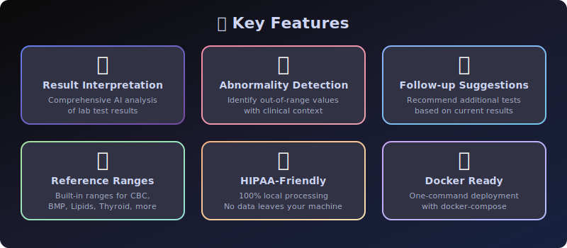

<div align="center">


# 🏥 Lab Results Interpreter

### AI-Powered Laboratory Result Analysis

[](https://python.org)
[](https://ollama.com)
[](LICENSE)
[]()
[]()
[]()
[]()

</div>

---

> ## ⚠️ Medical Disclaimer
>
> **This tool is for educational and informational purposes only. It is NOT a substitute for professional medical advice, diagnosis, or treatment. Always consult a qualified healthcare provider for interpretation of your lab results. Never disregard professional medical advice or delay seeking it because of information from this tool.**
>
> - 🚨 **Call 911** for medical emergencies
> - 📞 **Call 988** for mental health crises (Suicide & Crisis Lifeline)
> - 💬 **Text HOME to 741741** for Crisis Text Line
>
> *The developers assume no liability for any actions taken based on this tool's output.*

---

## 🌟 Overview

**Lab Results Interpreter** is an AI-powered tool that helps you understand laboratory test results using **Gemma 4** running locally via **Ollama**. It interprets blood work, urinalysis, metabolic panels, and more — explaining abnormalities and suggesting follow-up tests.

### 🔒 100% HIPAA-Friendly

All processing happens **locally on your machine**. No patient data is ever sent to external servers. Your lab results never leave your computer.



---

## ✨ Key Features

| Feature | Description |
|---------|-------------|
| 🔬 **Result Interpretation** | Comprehensive AI analysis of lab test results with clinical context |
| 🚨 **Abnormality Detection** | Automatically identify out-of-range values and explain significance |
| 📋 **Follow-up Suggestions** | Recommend additional tests based on current results |
| 📖 **Value Explanations** | Detailed explanation of any individual lab value |
| 📊 **Reference Ranges** | Built-in ranges for CBC, BMP, Lipid Panel, Liver Panel, Thyroid, Urinalysis |
| 🧪 **10+ Lab Panels** | Support for CBC, BMP, CMP, Lipid Panel, Liver Panel, Thyroid, Urinalysis, Coagulation, Iron Studies, HbA1c |
| 🖥️ **Web UI** | Professional Streamlit interface with dark theme |
| ⌨️ **CLI** | Rich terminal interface with Click |
| 🔌 **REST API** | FastAPI with Swagger documentation |
| 📜 **Session History** | Track interpretations across a session |
| 🐳 **Docker Ready** | One-command deployment with docker-compose |
| 🔒 **HIPAA-Friendly** | 100% local processing — no data leaves your machine |

---

## 🏗️ Architecture


```
┌─────────────────────────────────────────────────┐
│                   User Interface                 │
│  ┌──────────┐  ┌──────────┐  ┌──────────────┐  │
│  │ Streamlit│  │   CLI    │  │  FastAPI API  │  │
│  │ Web UI   │  │(Click)   │  │  (REST)      │  │
│  └────┬─────┘  └────┬─────┘  └──────┬───────┘  │
│       └──────────────┼───────────────┘          │
│                      ▼                           │
│  ┌──────────────────────────────────────────┐   │
│  │            Core Engine (core.py)          │   │
│  │  interpret_results • identify_abnormal    │   │
│  │  suggest_followup  • explain_lab_value    │   │
│  │  reference_ranges  • LabSession           │   │
│  └──────────────────┬───────────────────────┘   │
│                     ▼                            │
│  ┌──────────────────────────────────────────┐   │
│  │         Common LLM Client                 │   │
│  │    chat • chat_stream • generate • embed  │   │
│  └──────────────────┬───────────────────────┘   │
│                     ▼                            │
│  ┌──────────────────────────────────────────┐   │
│  │     Ollama + Gemma 4  (Local LLM)         │   │
│  │          http://localhost:11434            │   │
│  └──────────────────────────────────────────┘   │
└─────────────────────────────────────────────────┘
```

---

## 🚀 Quick Start

### Prerequisites

- **Python 3.10+**
- **Ollama** installed and running ([Install Ollama](https://ollama.com/download))
- **Gemma 4** model pulled

### 1. Install Ollama & Pull Model

```bash
# Install Ollama (see https://ollama.com/download)
# Then pull Gemma 4:
ollama pull gemma4
```

### 2. Clone & Install

```bash
cd 90-local-llm-projects/100-lab-results-interpreter

# Install dependencies
pip install -r requirements.txt
pip install -e .
```

### 3. Run

```bash
# Option A: Web UI (Streamlit)
streamlit run src/lab_results_interpreter/web_ui.py

# Option B: CLI
python -m lab_results_interpreter.cli interpret --results "WBC: 12.5, Hemoglobin: 11.0"

# Option C: REST API
uvicorn src.lab_results_interpreter.api:app --host 0.0.0.0 --port 8000

# Option D: Docker
docker-compose up --build
```

---

## 🖥️ Web UI (Streamlit)

```bash
streamlit run src/lab_results_interpreter/web_ui.py
```

Open **http://localhost:8501** in your browser.

### Features:
- 🧪 Lab panel selector (CBC, BMP, Lipid Panel, etc.)
- 📝 Lab results text area with example placeholders
- 👤 Patient context input (age, sex, medications)
- 📊 Interactive reference range tables
- 🔬 AI-powered interpretation
- 🚨 Abnormality highlighting
- 📋 Follow-up test recommendations
- 📜 Session history tracking

---

## ⌨️ CLI Usage

```bash
# Interpret lab results
python -m lab_results_interpreter.cli interpret \
  --results "WBC: 12.5 x10^3/µL, Hemoglobin: 11.0 g/dL, Platelets: 180 x10^3/µL" \
  --panel CBC \
  --context "45-year-old female"

# Identify abnormalities
python -m lab_results_interpreter.cli abnormalities \
  --results "Glucose: 250 mg/dL, BUN: 35 mg/dL" \
  --panel BMP

# Suggest follow-up tests
python -m lab_results_interpreter.cli followup \
  --results "TSH: 8.5 mIU/L, Free T4: 0.6 ng/dL" \
  --context "Patient reports fatigue and weight gain"

# Explain a specific lab value
python -m lab_results_interpreter.cli explain \
  --test "Hemoglobin" --value "11.0" --unit "g/dL"

# Show reference ranges for a panel
python -m lab_results_interpreter.cli reference --panel CBC

# List all available panels
python -m lab_results_interpreter.cli panels
```

---

## 🔌 REST API (FastAPI)

```bash
uvicorn src.lab_results_interpreter.api:app --host 0.0.0.0 --port 8000
```

Swagger docs available at **http://localhost:8000/docs**

### Endpoints

| Method | Endpoint | Description |
|--------|----------|-------------|
| `GET` | `/health` | Check API and Ollama health |
| `POST` | `/interpret` | Interpret lab results |
| `POST` | `/abnormalities` | Identify abnormal values |
| `POST` | `/followup` | Suggest follow-up tests |
| `POST` | `/explain` | Explain a specific lab value |
| `GET` | `/reference-ranges/{panel}` | Get reference ranges for a panel |
| `GET` | `/panels` | List available lab panels |
| `GET` | `/disclaimer` | Get the medical disclaimer |

### Example API Calls

```bash
# Health check
curl http://localhost:8000/health

# Interpret lab results
curl -X POST http://localhost:8000/interpret \
  -H "Content-Type: application/json" \
  -d '{
    "lab_results": "WBC: 12.5 x10^3/µL, Hemoglobin: 11.0 g/dL",
    "panel_type": "CBC",
    "patient_context": "45-year-old female"
  }'

# Identify abnormalities
curl -X POST http://localhost:8000/abnormalities \
  -H "Content-Type: application/json" \
  -d '{
    "lab_results": "Glucose: 250 mg/dL, Creatinine: 2.1 mg/dL",
    "panel_type": "BMP"
  }'

# Get reference ranges
curl http://localhost:8000/reference-ranges/CBC

# List panels
curl http://localhost:8000/panels
```

---

## 📊 Supported Lab Panels

| Panel | Tests Included | Reference Data |
|-------|---------------|----------------|
| **CBC** | WBC, RBC, Hemoglobin, Hematocrit, Platelets, MCV | ✅ |
| **BMP** | Glucose, BUN, Creatinine, Sodium, Potassium, Calcium, CO2 | ✅ |
| **CMP** | All BMP + Liver enzymes | — |
| **Lipid Panel** | Total Cholesterol, LDL, HDL, Triglycerides | ✅ |
| **Liver Panel** | ALT, AST, ALP, Bilirubin, Albumin | ✅ |
| **Thyroid** | TSH, Free T4, Free T3 | ✅ |
| **Urinalysis** | pH, Specific Gravity, Protein, Glucose | ✅ |
| **Coagulation** | PT, INR, aPTT | — |
| **Iron Studies** | Serum Iron, TIBC, Ferritin, Transferrin Saturation | — |
| **HbA1c** | Glycated Hemoglobin | — |

---

## 🐳 Docker

### Docker Compose (Recommended)

```bash
# Start all services (Web UI, API, Ollama)
docker-compose up --build

# Services:
#   - Web UI:  http://localhost:8501
#   - API:     http://localhost:8000
#   - Ollama:  http://localhost:11434
```

### Standalone Docker

```bash
# Build
docker build -t lab-results-interpreter .

# Run (assumes Ollama is running on host)
docker run -p 8501:8501 \
  -e OLLAMA_HOST=http://host.docker.internal:11434 \
  lab-results-interpreter
```

---

## 🧪 Testing

```bash
# Run all tests
pytest tests/ -v

# Run with coverage
pytest tests/ -v --cov=src/ --cov-report=term-missing

# Run specific test class
pytest tests/test_core.py::TestReferenceRanges -v
```

---

## 🛠️ Development

### Project Structure

```
100-lab-results-interpreter/
├── src/lab_results_interpreter/
│   ├── __init__.py          # Package version
│   ├── core.py              # Core interpretation engine
│   ├── cli.py               # Click CLI interface
│   ├── web_ui.py            # Streamlit web UI
│   ├── api.py               # FastAPI REST API
│   └── config.py            # Configuration loader
├── tests/
│   └── test_core.py         # Comprehensive test suite
├── examples/
│   ├── demo.py              # Demo script
│   └── README.md            # Examples documentation
├── docs/images/
│   ├── banner.svg           # Project banner
│   ├── architecture.svg     # Architecture diagram
│   └── features.svg         # Features showcase
├── .github/workflows/
│   └── ci.yml               # GitHub Actions CI
├── common/
│   ├── __init__.py
│   └── llm_client.py        # Shared Ollama client
├── config.yaml              # Configuration file
├── setup.py                 # Package setup
├── requirements.txt         # Python dependencies
├── Makefile                 # Development commands
├── Dockerfile               # Container build
├── docker-compose.yml       # Multi-service deployment
├── .dockerignore            # Docker build exclusions
├── .env.example             # Environment template
├── CONTRIBUTING.md          # Contribution guide
├── CHANGELOG.md             # Version history
└── README.md                # This file
```

### Make Commands

```bash
make help       # Show all commands
make install    # Install dependencies
make test       # Run tests
make lint       # Check syntax
make run-cli    # Run CLI tool
make run-web    # Launch Streamlit web UI
make run-api    # Launch FastAPI server
make clean      # Clean build artifacts
```

### Configuration

Edit `config.yaml` to customize:

```yaml
model: "gemma4"          # LLM model name
temperature: 0.3         # Lower = more precise interpretations
max_tokens: 2048         # Response length limit
log_level: "INFO"        # Logging verbosity
ollama_url: "http://localhost:11434"
```

Environment variables override config.yaml:

```bash
export OLLAMA_MODEL=gemma4
export OLLAMA_BASE_URL=http://localhost:11434
export LOG_LEVEL=DEBUG
```

---

## 📚 Reference Range Data

The tool includes built-in reference ranges for common lab tests. These are general adult reference ranges and may vary by laboratory, age, sex, and other factors.

### Example: CBC Reference Ranges

| Test | Range | Unit | Description |
|------|-------|------|-------------|
| WBC | 4.5-11.0 | x10³/µL | White Blood Cell Count |
| RBC | 4.5-5.5 | x10⁶/µL | Red Blood Cell Count |
| Hemoglobin | 13.5-17.5 | g/dL | Hemoglobin |
| Hematocrit | 38.3-48.6 | % | Hematocrit |
| Platelets | 150-400 | x10³/µL | Platelet Count |
| MCV | 80-100 | fL | Mean Corpuscular Volume |

> **Note:** Reference ranges are for general educational purposes. Your laboratory's specific ranges may differ. Always use the reference ranges printed on your lab report.

---

## 🔒 Privacy & Security

- **100% Local Processing** — All AI inference runs on your machine via Ollama
- **No External API Calls** — Patient data never leaves your computer
- **No Data Storage** — Session data exists only in memory during use
- **No Telemetry** — No usage data is collected or transmitted
- **HIPAA-Friendly** — Designed for environments where data privacy is critical

---

## 🤝 Contributing

We welcome contributions! See [CONTRIBUTING.md](CONTRIBUTING.md) for guidelines.

1. Fork the repository
2. Create a feature branch
3. Add tests for new features
4. Submit a pull request

---

## 📄 License

This project is licensed under the MIT License.

---

## 🙏 Acknowledgments

- **[Ollama](https://ollama.com)** — Local LLM runtime
- **[Google Gemma 4](https://ai.google.dev/gemma)** — Open-weight language model
- **[Streamlit](https://streamlit.io)** — Web UI framework
- **[FastAPI](https://fastapi.tiangolo.com)** — Modern Python web framework
- **[Click](https://click.palletsprojects.com)** — CLI framework
- **[Rich](https://rich.readthedocs.io)** — Terminal formatting

---

<div align="center">

**Built with ❤️ for healthcare education**

*Part of the [90 Local LLM Projects](https://github.com/kennedyraju55) series*

🏥 **Project 100 of 100** — Lab Results Interpreter

</div>
