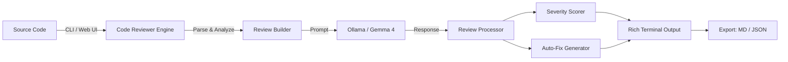

<div align="center">

<picture>
  <source media="(prefers-color-scheme: dark)" srcset="https://img.shields.io/badge/%F0%9F%94%8D_CODE_REVIEW_BOT-AI--Powered_Code_Analysis-00d4ff?style=for-the-badge&labelColor=0d1117">
  
</picture>

<br/>

<svg xmlns="http://www.w3.org/2000/svg" viewBox="0 0 600 120" width="600" height="120">
  <defs>
    <linearGradient id="grad1" x1="0%" y1="0%" x2="100%" y2="100%">
      <stop offset="0%" style="stop-color:#00d4ff;stop-opacity:1" />
      <stop offset="100%" style="stop-color:#0066cc;stop-opacity:1" />
    </linearGradient>
  </defs>
  <rect width="600" height="120" rx="16" fill="#0d1117"/>
  <text x="300" y="55" text-anchor="middle" font-family="Segoe UI,Arial" font-size="36" font-weight="bold" fill="url(#grad1)">🔍 Code Review Bot</text>
  <text x="300" y="90" text-anchor="middle" font-family="Segoe UI,Arial" font-size="16" fill="#8b949e">AI-Powered Code Review • Severity Scoring • Auto-Fix</text>
</svg>

<br/>

[](https://python.org)
[](LICENSE)
[](https://ollama.ai)
[](https://ai.google.dev/gemma)
[](https://streamlit.io)

*Comprehensive AI code review with multi-file analysis, severity scoring, auto-fix suggestions, and beautiful reports — all powered by a local Gemma 4 LLM via Ollama.*

</div>

---

## 🏗️ Architecture



```
┌─────────────┐     ┌──────────────┐     ┌─────────────┐
│  CLI / Web  │────▶│  Core Engine  │────▶│  Ollama API │
│  Interface  │     │  • Review     │     │  (Gemma 4)  │
│  (Click /   │     │  • Auto-fix   │     └─────────────┘
│  Streamlit) │     │  • Export     │            │
└─────────────┘     └──────────────┘            │
       │                    │              ┌────▼────┐
       ▼                    ▼              │ Response │
┌─────────────┐     ┌──────────────┐      └────┬────┘
│  Config     │     │  Utilities   │           │
│  (YAML/ENV) │     │  • Detect    │      ┌────▼────────┐
└─────────────┘     │  • Score     │      │ Review      │
                    │  • Format    │      │ Results     │
                    └──────────────┘      └─────────────┘
```

## ✨ Features

| Feature | Description |
|---------|-------------|
| 🔍 **Multi-Category Review** | Detects bugs, style issues, security vulnerabilities, performance problems & best practices |
| 📁 **Multi-File Review** | Review entire directories with configurable glob patterns |
| 🎯 **Severity Scoring** | HIGH / MEDIUM / LOW ratings with overall code quality grade (A-F) |
| 🔧 **Auto-Fix Suggestions** | AI-generated corrected code for HIGH & MEDIUM issues |
| 📊 **Report Export** | Export reviews to Markdown or JSON format |
| 🌐 **Streamlit Web UI** | Beautiful web interface with code editor, file upload & live results |
| 📏 **Focus Areas** | Narrow reviews to specific concerns (security, performance, etc.) |
| 🎨 **Rich Terminal Output** | Colored, structured CLI output with syntax highlighting |
| ⚙️ **YAML Configuration** | Flexible config with environment variable overrides |
| 📝 **Diff Annotations** | Line-by-line references for every finding |

## 📸 Screenshots

<div align="center">

| CLI Review | Web UI |
|:---:|:---:|
|  |  |

| Severity Report | Auto-Fix |
|:---:|:---:|
|  |  |

</div>

## 📦 Installation

```bash
# Clone the repository
cd 21-code-review-bot

# Install dependencies
pip install -r requirements.txt

# Or install as a package
pip install -e .

# Verify Ollama is running
ollama serve
ollama pull gemma4
```

## 🚀 CLI Usage

```bash
# Review a single file
python -m code_reviewer.cli review --file script.py

# Review with specific focus areas
python -m code_reviewer.cli review --file script.py --focus "security,performance"

# Show source code alongside review
python -m code_reviewer.cli review --file script.py --show-code

# Generate auto-fix suggestions
python -m code_reviewer.cli review --file script.py --autofix

# Export review to file
python -m code_reviewer.cli review --file script.py --output review_report.md
python -m code_reviewer.cli review --file script.py --output review_report.json

# Review all Python files in a directory
python -m code_reviewer.cli review-dir --dir ./src --pattern "*.py"

# Review with custom config
python -m code_reviewer.cli --config custom.yaml review --file script.py

# Verbose mode
python -m code_reviewer.cli -v review --file script.py
```

## 🌐 Web UI Usage

```bash
# Launch the Streamlit web interface
streamlit run src/code_reviewer/web_ui.py

# Then open http://localhost:8501 in your browser
```

**Web UI Features:**
- 📝 Paste code directly in the editor
- 📁 Upload code files for review
- ⚙️ Configure model, temperature, and focus areas in the sidebar
- 🔧 Toggle auto-fix generation
- 📥 Download review reports as Markdown

## 📋 Example Output

```
╭──────────────────────────────────────────────────╮
│  🔍 Code Review Bot                             │
│  AI-powered code review with severity scoring    │
╰──────────────────────────────────────────────────╯

Reviewing: api_handler.py

╭── 📋 Code Review Results ───────────────────────╮
│ ## 🔒 Security Issues                           │
│ - **Line 15** [HIGH] SQL injection vulnerability │
│   Fix: Use parameterized queries                 │
│                                                  │
│ ## ⚡ Performance                                │
│ - **Line 42** [MEDIUM] Nested loop O(n²)        │
│   Fix: Consider using a hash map                 │
│                                                  │
│ ## 🎨 Style                                     │
│ - **Line 8** [LOW] Missing type hints            │
│   Fix: Add type annotations to function args     │
╰──────────────────────────────────────────────────╯

┌─────────────────── Review Summary ───────────────┐
│ File         │ Language │ Lines │ Focus │ Status  │
│ api_handler  │ python   │ 87    │ All   │ ✅ Done │
└──────────────────────────────────────────────────┘
```

## 🧪 Testing

```bash
# Run all tests
python -m pytest tests/ -v

# Run with coverage
python -m pytest tests/ -v --cov=src/code_reviewer --cov-report=term-missing

# Run specific test file
python -m pytest tests/test_core.py -v
```

## 📁 Project Structure

```
21-code-review-bot/
├── src/code_reviewer/
│   ├── __init__.py          # Package metadata
│   ├── core.py              # Core review logic & LLM interaction
│   ├── cli.py               # Click CLI interface
│   ├── web_ui.py            # Streamlit web interface
│   ├── config.py            # YAML/env configuration management
│   └── utils.py             # Helpers: language detection, scoring
├── tests/
│   ├── __init__.py
│   ├── test_core.py         # Core logic tests
│   └── test_cli.py          # CLI integration tests
├── config.yaml              # Default configuration
├── setup.py                 # Package setup
├── requirements.txt         # Dependencies
├── Makefile                 # Dev commands
├── .env.example             # Environment template
└── README.md                # This file
```

## ⚙️ Configuration

Edit `config.yaml` or set environment variables:

```yaml
ollama_base_url: "http://localhost:11434"
model: "gemma4"
temperature: 0.3
max_tokens: 4096
max_file_size_kb: 500
output_format: "markdown"
log_level: "INFO"
```

| Environment Variable | Description | Default |
|---------------------|-------------|---------|
| `OLLAMA_BASE_URL` | Ollama server URL | `http://localhost:11434` |
| `OLLAMA_MODEL` | LLM model name | `gemma4` |
| `LOG_LEVEL` | Logging level | `INFO` |

## 🤝 Contributing

1. Fork the repository
2. Create a feature branch (`git checkout -b feature/amazing-feature`)
3. Commit your changes (`git commit -m 'feat: add amazing feature'`)
4. Push to the branch (`git push origin feature/amazing-feature`)
5. Open a Pull Request

## 📄 License

This project is part of the [90 Local LLM Projects](../README.md) collection. See the root [LICENSE](../LICENSE) file for details.

## ⚙️ Requirements

- Python 3.10+
- Ollama running locally with Gemma 4 model
- ~4GB RAM for the LLM model
