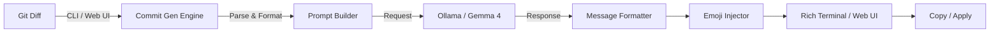

<div align="center">

<picture>
  <source media="(prefers-color-scheme: dark)" srcset="https://img.shields.io/badge/%F0%9F%93%9D_COMMIT_MESSAGE_GENERATOR-AI--Powered_Git_Commits-a855f7?style=for-the-badge&labelColor=0d1117">
  
</picture>

<br/>

<svg xmlns="http://www.w3.org/2000/svg" viewBox="0 0 600 120" width="600" height="120">
  <defs>
    <linearGradient id="grad1" x1="0%" y1="0%" x2="100%" y2="100%">
      <stop offset="0%" style="stop-color:#a855f7;stop-opacity:1" />
      <stop offset="100%" style="stop-color:#6d28d9;stop-opacity:1" />
    </linearGradient>
  </defs>
  <rect width="600" height="120" rx="16" fill="#0d1117"/>
  <text x="300" y="55" text-anchor="middle" font-family="Segoe UI,Arial" font-size="36" font-weight="bold" fill="url(#grad1)">📝 Commit Message Generator</text>
  <text x="300" y="90" text-anchor="middle" font-family="Segoe UI,Arial" font-size="16" fill="#8b949e">Conventional Commits • Emoji Support • Git Integration</text>
</svg>

<br/>

[](https://python.org)
[](LICENSE)
[](https://ollama.ai)
[](https://ai.google.dev/gemma)
[](https://streamlit.io)

*Generate perfect conventional commit messages from git diffs — with emoji support, batch mode, and a beautiful web UI. Powered by local Gemma 4 LLM via Ollama.*

</div>

---

## 🏗️ Architecture



```
┌──────────────┐     ┌──────────────┐     ┌─────────────┐
│  Git Repo /  │────▶│  Core Engine  │────▶│  Ollama API │
│  Pasted Diff │     │  • Generate   │     │  (Gemma 4)  │
│  Diff File   │     │  • Batch      │     └─────────────┘
└──────────────┘     │  • Emoji      │            │
       │             └──────────────┘            │
       ▼                    │              ┌────▼─────────┐
┌──────────────┐     ┌──────────────┐      │ Conventional │
│  CLI (Click) │     │  Web UI      │      │ Commit Msgs  │
│  • generate  │     │  (Streamlit) │      └──────────────┘
│  • from-text │     │  • Paste     │
└──────────────┘     │  • Git read  │
                     └──────────────┘
```

## ✨ Features

| Feature | Description |
|---------|-------------|
| 📝 **Conventional Commits** | Follows the spec: `type(scope): description` with body & footer |
| ✨ **Emoji Support** | Auto-adds emoji prefixes (✨ feat, 🐛 fix, ♻️ refactor, etc.) |
| 🔀 **Git Integration** | Auto-reads staged/unstaged changes from the current repo |
| 📊 **Diff Stats** | Shows file changes summary before generating messages |
| 🔢 **Multiple Suggestions** | Get 1-10 ranked commit message options |
| 📦 **Batch Mode** | Generate messages for multiple diffs at once |
| 🌐 **Streamlit Web UI** | Paste diffs, select style, copy generated messages |
| 📄 **File Input** | Read diff from a `.diff` file or stdin pipe |
| ⚙️ **YAML Config** | Flexible configuration with env variable overrides |
| 🎨 **Rich Terminal** | Beautiful colored output with panels |

## 📸 Screenshots

<div align="center">

| CLI Output | Web UI |
|:---:|:---:|
|  |  |

| Git Integration | Emoji Commits |
|:---:|:---:|
|  |  |

</div>

## 📦 Installation

```bash
cd 22-commit-message-generator
pip install -r requirements.txt

# Or install as a package
pip install -e .

# Ensure Ollama is running
ollama serve
ollama pull gemma4
```

## 🚀 CLI Usage

```bash
# Generate from staged changes (default)
python -m commit_gen.cli generate

# Include unstaged changes
python -m commit_gen.cli generate --all

# Specify commit type
python -m commit_gen.cli generate --type feat

# Read from a diff file
python -m commit_gen.cli generate --diff-file changes.diff

# Disable emoji
python -m commit_gen.cli generate --no-emoji

# Generate from pasted text
python -m commit_gen.cli from-text "diff content here"

# Pipe from git
git diff | python -m commit_gen.cli generate

# Verbose mode
python -m commit_gen.cli -v generate
```

## 🌐 Web UI Usage

```bash
streamlit run src/commit_gen/web_ui.py
# Open http://localhost:8501
```

**Web UI Features:**
- 📋 Paste diff directly
- 🔀 Read staged/all changes from git
- 🎨 Select commit type and style
- ✨ Toggle emoji prefixes
- 📥 Download generated messages

## 📋 Example Output

```
╭──────────────────────────────────────────────╮
│  📝 Commit Message Generator                 │
│  Generate conventional commit messages       │
╰──────────────────────────────────────────────╯

Branch: main | Mode: staged
Staged files: auth.py, utils.py

╭── 📊 Changes Summary ────────────────────────╮
│ 2 files changed, 15 insertions(+), 3 del(-) │
╰──────────────────────────────────────────────╯

╭── 💡 Suggested Commit Messages ──────────────╮
│ 1. ✨ feat(auth): add JWT token refresh      │
│ 2. ✨ feat: implement token refresh logic    │
│ 3. ♻️  refactor(auth): add automatic refresh  │
╰──────────────────────────────────────────────╯
```

## 🧪 Testing

```bash
python -m pytest tests/ -v
python -m pytest tests/ -v --cov=src/commit_gen --cov-report=term-missing
```

## 📁 Project Structure

```
22-commit-message-generator/
├── src/commit_gen/
│   ├── __init__.py          # Package metadata
│   ├── core.py              # Commit message generation logic
│   ├── cli.py               # Click CLI interface
│   ├── web_ui.py            # Streamlit web interface
│   ├── config.py            # YAML/env configuration
│   └── utils.py             # Git helpers, diff processing
├── tests/
│   ├── __init__.py
│   ├── test_core.py         # Core logic tests
│   └── test_cli.py          # CLI integration tests
├── config.yaml              # Default configuration
├── setup.py                 # Package setup
├── requirements.txt         # Dependencies
├── Makefile                 # Dev commands
├── .env.example             # Environment template
└── README.md                # This file
```

## ⚙️ Configuration

```yaml
model: "gemma4"
temperature: 0.5
num_suggestions: 3
use_emoji: true
conventional: true
max_diff_chars: 4000
```

| Environment Variable | Description | Default |
|---------------------|-------------|---------|
| `OLLAMA_BASE_URL` | Ollama server URL | `http://localhost:11434` |
| `OLLAMA_MODEL` | LLM model name | `gemma4` |
| `LOG_LEVEL` | Logging level | `INFO` |

## 🤝 Contributing

1. Fork the repository
2. Create a feature branch (`git checkout -b feature/amazing-feature`)
3. Commit your changes (`git commit -m 'feat: add amazing feature'`)
4. Push to the branch (`git push origin feature/amazing-feature`)
5. Open a Pull Request

## 📄 License

Part of [90 Local LLM Projects](../README.md). See root [LICENSE](../LICENSE).

## ⚙️ Requirements

- Python 3.10+
- Git installed and in PATH
- Ollama running locally with Gemma 4 model
