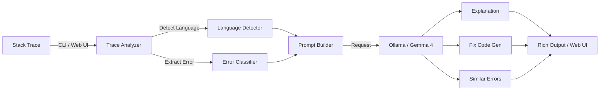

<div align="center">

<picture>
  <source media="(prefers-color-scheme: dark)" srcset="https://img.shields.io/badge/%F0%9F%94%A5_STACK_TRACE_EXPLAINER-AI--Powered_Debugging-ff6b35?style=for-the-badge&labelColor=0d1117">
  
</picture>

<br/>

<svg xmlns="http://www.w3.org/2000/svg" viewBox="0 0 600 120" width="600" height="120">
  <defs>
    <linearGradient id="grad1" x1="0%" y1="0%" x2="100%" y2="100%">
      <stop offset="0%" style="stop-color:#ff6b35;stop-opacity:1" />
      <stop offset="100%" style="stop-color:#cc2200;stop-opacity:1" />
    </linearGradient>
  </defs>
  <rect width="600" height="120" rx="16" fill="#0d1117"/>
  <text x="300" y="55" text-anchor="middle" font-family="Segoe UI,Arial" font-size="36" font-weight="bold" fill="url(#grad1)">🔥 Stack Trace Explainer</text>
  <text x="300" y="90" text-anchor="middle" font-family="Segoe UI,Arial" font-size="16" fill="#8b949e">Multi-Language • Fix Generation • Error Database</text>
</svg>

<br/>

[](https://python.org)
[](LICENSE)
[](https://ollama.ai)
[](https://ai.google.dev/gemma)
[](https://streamlit.io)

*Understand any stack trace in plain English — with multi-language support, fix code generation, similar error search, and a built-in error reference database. Powered by local Gemma 4 LLM.*

</div>

---

## 🏗️ Architecture



```
┌─────────────┐     ┌──────────────────┐     ┌─────────────┐
│  Input:     │────▶│  Core Engine      │────▶│  Ollama API │
│  • File     │     │  • explain_trace  │     │  (Gemma 4)  │
│  • Text     │     │  • fix_code       │     └─────────────┘
│  • Stdin    │     │  • similar_errors │
└─────────────┘     └──────────────────┘
       │                    │
       ▼                    ▼
┌─────────────┐     ┌──────────────────┐
│  Language   │     │  Error Database  │
│  Detection  │     │  • Python        │
│  (11 langs) │     │  • JavaScript    │
└─────────────┘     │  • Java + more   │
                    └──────────────────┘
```

## ✨ Features

| Feature | Description |
|---------|-------------|
| 🌍 **Multi-Language Support** | Python, JavaScript, Java, C#, Go, Rust, Ruby, PHP, Kotlin, Swift, C++ |
| 💡 **Plain English Explanations** | Complex errors explained simply with root cause analysis |
| 🔧 **Fix Code Generation** | AI-generated corrected code for the identified error |
| 🔗 **Similar Error Search** | Find related errors and learn to distinguish between them |
| 📚 **Error Reference Database** | Built-in database of common errors and quick hints |
| 🎯 **Auto Language Detection** | Automatically identifies the programming language |
| 📜 **Call Chain Walkthrough** | Frame-by-frame explanation of the stack trace |
| 🌐 **Streamlit Web UI** | Beautiful web interface with trace input and live results |
| ⚙️ **YAML Configuration** | Flexible config with environment variable overrides |
| 🎨 **Rich Terminal** | Colored, structured CLI output |

## 📸 Screenshots

<div align="center">

| CLI Explanation | Web UI |
|:---:|:---:|
|  |  |

| Fix Code | Similar Errors |
|:---:|:---:|
|  |  |

</div>

## 📦 Installation

```bash
cd 23-stack-trace-explainer
pip install -r requirements.txt
pip install -e .

ollama serve && ollama pull gemma4
```

## 🚀 CLI Usage

```bash
# Explain from a file
python -m stack_explainer.cli explain --trace error.txt

# Explain from text
python -m stack_explainer.cli explain --text "Traceback (most recent call last):..."

# With language hint
python -m stack_explainer.cli explain --trace error.txt --lang java

# Generate fix code
python -m stack_explainer.cli explain --trace error.txt --fix

# Find similar errors
python -m stack_explainer.cli explain --trace error.txt --similar

# Pipe from command
python buggy_script.py 2>&1 | python -m stack_explainer.cli explain

# Verbose mode
python -m stack_explainer.cli -v explain --trace error.txt
```

## 🌐 Web UI Usage

```bash
streamlit run src/stack_explainer/web_ui.py
# Open http://localhost:8501
```

## 📋 Example Output

```
╭──────────────────────────────────────────────────╮
│  🔥 Stack Trace Explainer                        │
╰──────────────────────────────────────────────────╯

Detected language: python
Quick hint: Accessing a dictionary key that doesn't exist

╭── 📜 Stack Trace ───────────────────────────────╮
│ Traceback (most recent call last):               │
│   File "app.py", line 42, in main                │
│     result = data["key"]                         │
│ KeyError: 'key'                                  │
╰──────────────────────────────────────────────────╯

╭── 💡 Explanation & Fix ─────────────────────────╮
│ ## Error Summary                                 │
│ A KeyError occurs when accessing a dictionary    │
│ key that doesn't exist.                          │
│                                                  │
│ ## Fix                                           │
│ Use `data.get("key", default_value)`             │
╰──────────────────────────────────────────────────╯
```

## 🧪 Testing

```bash
python -m pytest tests/ -v
python -m pytest tests/ -v --cov=src/stack_explainer --cov-report=term-missing
```

## 📁 Project Structure

```
23-stack-trace-explainer/
├── src/stack_explainer/
│   ├── __init__.py          # Package metadata
│   ├── core.py              # Explanation engine & LLM interaction
│   ├── cli.py               # Click CLI interface
│   ├── web_ui.py            # Streamlit web interface
│   ├── config.py            # YAML/env configuration
│   └── utils.py             # Language detection, error database
├── tests/
│   ├── __init__.py
│   ├── test_core.py         # Core logic tests
│   └── test_cli.py          # CLI integration tests
├── config.yaml              # Default configuration
├── setup.py                 # Package setup
├── requirements.txt         # Dependencies
├── Makefile                 # Dev commands
├── .env.example             # Environment template
└── README.md                # This file
```

## ⚙️ Configuration

```yaml
model: "gemma4"
temperature: 0.3
max_tokens: 4096
max_trace_chars: 5000
```

| Environment Variable | Description | Default |
|---------------------|-------------|---------|
| `OLLAMA_BASE_URL` | Ollama server URL | `http://localhost:11434` |
| `OLLAMA_MODEL` | LLM model name | `gemma4` |
| `LOG_LEVEL` | Logging level | `INFO` |

## 🤝 Contributing

1. Fork the repository
2. Create a feature branch (`git checkout -b feature/amazing-feature`)
3. Commit changes (`git commit -m 'feat: add amazing feature'`)
4. Push to branch (`git push origin feature/amazing-feature`)
5. Open a Pull Request

## 📄 License

Part of [90 Local LLM Projects](../README.md). See root [LICENSE](../LICENSE).

## ⚙️ Requirements

- Python 3.10+
- Ollama running locally with Gemma 4 model
