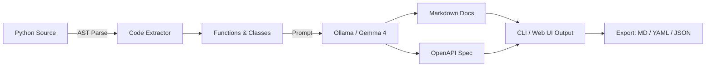

<div align="center">

<picture>
  <source media="(prefers-color-scheme: dark)" srcset="https://img.shields.io/badge/%F0%9F%93%9A_API_DOC_GENERATOR-AI--Powered_Docs-f59e0b?style=for-the-badge&labelColor=0d1117">
  
</picture>

<br/>

<svg xmlns="http://www.w3.org/2000/svg" viewBox="0 0 600 120" width="600" height="120">
  <defs>
    <linearGradient id="grad1" x1="0%" y1="0%" x2="100%" y2="100%">
      <stop offset="0%" style="stop-color:#f59e0b;stop-opacity:1" />
      <stop offset="100%" style="stop-color:#d97706;stop-opacity:1" />
    </linearGradient>
  </defs>
  <rect width="600" height="120" rx="16" fill="#0d1117"/>
  <text x="300" y="55" text-anchor="middle" font-family="Segoe UI,Arial" font-size="36" font-weight="bold" fill="url(#grad1)">📚 API Doc Generator</text>
  <text x="300" y="90" text-anchor="middle" font-family="Segoe UI,Arial" font-size="16" fill="#8b949e">OpenAPI/Swagger • Markdown Export • AST Analysis</text>
</svg>

<br/>

[](https://python.org)
[](LICENSE)
[](https://ollama.ai)
[](https://ai.google.dev/gemma)
[](https://streamlit.io)

*Generate professional API documentation from Python source code — with OpenAPI/Swagger output, endpoint grouping, example request/response, and markdown export. Powered by local Gemma 4 LLM.*

</div>

---

## 🏗️ Architecture



```
┌──────────────┐     ┌──────────────────┐     ┌─────────────┐
│  Source Code  │────▶│  AST Extractor    │────▶│  Ollama API │
│  • File      │     │  • Functions      │     │  (Gemma 4)  │
│  • Directory │     │  • Classes        │     └─────────────┘
│  • Upload    │     │  • Decorators     │            │
└──────────────┘     └──────────────────┘            │
                            │                  ┌────▼────────┐
                     ┌──────▼──────┐           │ Markdown    │
                     │  OpenAPI    │           │ API Docs    │
                     │  Skeleton   │           └─────────────┘
                     │  Generator  │
                     └─────────────┘
```

## ✨ Features

| Feature | Description |
|---------|-------------|
| 📝 **Markdown Documentation** | Professional API reference docs with examples |
| 📄 **OpenAPI/Swagger** | Generate OpenAPI 3.0 specs from code structure |
| 🔍 **AST-based Analysis** | Accurate code parsing using Python's AST module |
| 📁 **Directory Scanning** | Recursively process entire project directories |
| 🔄 **Async Support** | Properly documents async functions and methods |
| 🏷️ **Decorator Detection** | Captures route decorators and annotations |
| 📊 **Code Inspection** | Inspect source structure without generating docs |
| 🌐 **Streamlit Web UI** | Upload files, preview docs, export with one click |
| 📥 **Multiple Export Formats** | Markdown, YAML (OpenAPI), JSON |
| ⚙️ **YAML Configuration** | Flexible config with environment overrides |

## 📸 Screenshots

<div align="center">

| CLI Output | Web UI |
|:---:|:---:|
|  |  |

| OpenAPI | Code Inspector |
|:---:|:---:|
|  |  |

</div>

## 📦 Installation

```bash
cd 25-api-doc-generator
pip install -r requirements.txt
pip install -e .

ollama serve && ollama pull gemma4
```

## 🚀 CLI Usage

```bash
# Generate docs for a single file
python -m api_doc_gen.cli generate --source module.py

# Generate docs for a directory
python -m api_doc_gen.cli generate --source src/

# Save to a file
python -m api_doc_gen.cli generate --source src/ --output docs.md

# Generate OpenAPI specification
python -m api_doc_gen.cli openapi --source src/ --output openapi.yaml

# Inspect code structure (no LLM needed)
python -m api_doc_gen.cli inspect --source src/

# Verbose mode
python -m api_doc_gen.cli -v generate --source module.py
```

## 🌐 Web UI Usage

```bash
streamlit run src/api_doc_gen/web_ui.py
# Open http://localhost:8501
```

**Web UI Features:**
- 📁 Upload Python files directly
- 📂 Specify local directory path
- 📚 Preview generated documentation
- 📄 Toggle OpenAPI spec generation
- 📥 Download as Markdown or YAML

## 📋 Example Output

```
╭──────────────────────────────────────────────────╮
│  📚 API Doc Generator                            │
│  Generate API docs from Python source code       │
╰──────────────────────────────────────────────────╯

Source: src/
Found 5 Python file(s)

╭── 📚 API Documentation ─────────────────────────╮
│ # API Reference                                  │
│                                                  │
│ ## `add(a: int, b: int) -> int`                  │
│ Add two numbers together.                        │
│                                                  │
│ | Param | Type | Description        |            │
│ |-------|------|---------------------|            │
│ | a     | int  | First number       |            │
│ | b     | int  | Second number      |            │
│                                                  │
│ **Returns:** `int` — Sum of a and b              │
│                                                  │
│ **Example:**                                     │
│ ```python                                        │
│ result = add(3, 5)  # returns 8                  │
│ ```                                              │
╰──────────────────────────────────────────────────╯

Files processed: 5 | Items documented: 23
```

## 🧪 Testing

```bash
python -m pytest tests/ -v
python -m pytest tests/ -v --cov=src/api_doc_gen --cov-report=term-missing
```

## 📁 Project Structure

```
25-api-doc-generator/
├── src/api_doc_gen/
│   ├── __init__.py          # Package metadata
│   ├── core.py              # Doc generation engine
│   ├── cli.py               # Click CLI interface
│   ├── web_ui.py            # Streamlit web interface
│   ├── config.py            # YAML/env configuration
│   └── utils.py             # AST extraction, OpenAPI skeleton
├── tests/
│   ├── __init__.py
│   ├── test_core.py         # Core logic tests
│   └── test_cli.py          # CLI tests
├── config.yaml              # Default configuration
├── setup.py                 # Package setup
├── requirements.txt         # Dependencies
├── Makefile                 # Dev commands
├── .env.example             # Environment template
└── README.md                # This file
```

## ⚙️ Configuration

```yaml
model: "gemma4"
temperature: 0.3
max_tokens: 4096
output_format: "markdown"
include_examples: true
include_openapi: false
```

| Environment Variable | Description | Default |
|---------------------|-------------|---------|
| `OLLAMA_BASE_URL` | Ollama server URL | `http://localhost:11434` |
| `OLLAMA_MODEL` | LLM model name | `gemma4` |
| `LOG_LEVEL` | Logging level | `INFO` |

## 🤝 Contributing

1. Fork → Branch → Commit → Push → PR

## 📄 License

Part of [90 Local LLM Projects](../README.md). See root [LICENSE](../LICENSE).

## ⚙️ Requirements

- Python 3.10+
- Ollama running locally with Gemma 4 model
