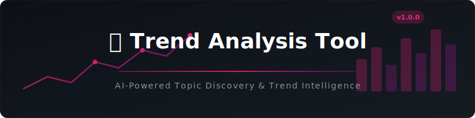
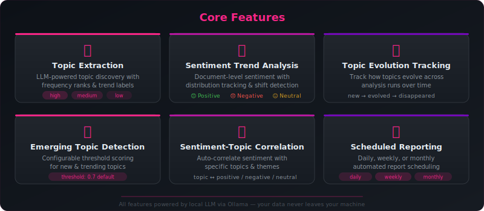
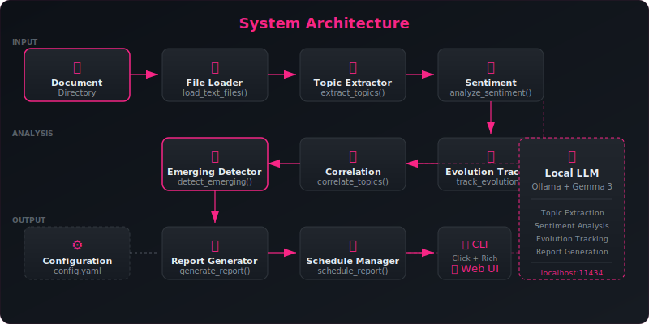

<div align="center">

<!-- Banner -->
<picture>
  <source media="(prefers-color-scheme: dark)" srcset="docs/images/banner.svg"/>
  <source media="(prefers-color-scheme: light)" srcset="docs/images/banner.svg"/>
  
</picture>

<br/>
<br/>

<!-- Badges -->
[](https://www.python.org/)
[](https://ollama.ai/)
[](https://streamlit.io/)
[](LICENSE)

[](https://github.com/kennedyraju55/trend-analysis-tool/actions)
[](https://docs.pytest.org/)
[](https://github.com/psf/black)
[]()
[]()
[](https://github.com/kennedyraju55/trend-analysis-tool/stargazers)
[](https://github.com/kennedyraju55/trend-analysis-tool/issues)
[](https://github.com/kennedyraju55/trend-analysis-tool/commits/master)

<br/>

**Production-grade trend analysis powered by local LLMs** — extract topics, track sentiment, detect emerging trends, and generate comprehensive intelligence reports. **100 % offline. Your data never leaves your machine.**

<br/>

Part of the [**90 Local LLM Projects**](https://github.com/kennedyraju55/90-local-llm-projects) collection

<br/>

[Quick Start](#-quick-start) · [CLI Reference](#-cli-reference) · [Web UI](#-web-ui) · [API Docs](#-api-reference) · [Configuration](#%EF%B8%8F-configuration) · [FAQ](#-frequently-asked-questions)

</div>

<br/>

---

<br/>

## 🤔 Why Trend Analysis Tool?

| Challenge | Without This Tool | With This Tool |
|-----------|-------------------|----------------|
| **Topic Discovery** | Manually skim hundreds of documents to identify themes | LLM extracts topics with frequency ranks and trend direction automatically |
| **Sentiment Tracking** | Gut-feel assessment of overall mood in a corpus | Quantified sentiment distribution with positive/negative/neutral counts and shift detection |
| **Emerging Trends** | Miss newly-forming topics until they're obvious | Configurable threshold scoring surfaces emerging topics the moment they cross your threshold |
| **Cross-run Comparison** | No memory of previous analyses | Topic evolution tracking compares current vs. prior topics — new, evolved, disappeared |
| **Report Generation** | Hours compiling executive summaries by hand | LLM generates markdown reports with executive summary, insights, and predictions |
| **Privacy** | Cloud APIs see your data | Fully local — Ollama + Gemma 3, nothing leaves `localhost` |

<br/>

---

<br/>

## ✨ Features

<div align="center">
<picture>
  <source media="(prefers-color-scheme: dark)" srcset="docs/images/features.svg"/>
  <source media="(prefers-color-scheme: light)" srcset="docs/images/features.svg"/>
  
</picture>
</div>

<br/>

| # | Feature | Description | Function |
|---|---------|-------------|----------|
| 1 | 🔍 **Topic Extraction** | LLM-powered identification of key topics with frequency (`high` / `medium` / `low`) and trend labels (`emerging` / `growing` / `stable` / `declining`) | `extract_topics()` |
| 2 | 💭 **Sentiment Trend Analysis** | Document-level sentiment tracking with distribution counts, shift detection, and key positive/negative theme extraction | `analyze_sentiment_trends()` |
| 3 | 📊 **Topic Evolution Tracking** | Compare current vs. previous analysis — surfaces new topics, evolved topics, and topics that have disappeared | `track_topic_evolution()` |
| 4 | 🚨 **Emerging Topic Detection** | Heuristic scoring using trend direction (60 %) + frequency rank (40 %) with configurable threshold (default 0.7) | `detect_emerging_topics()` |
| 5 | 🔗 **Sentiment–Topic Correlation** | Automatically matches each topic against positive/negative theme lists to assign per-topic sentiment | `correlate_sentiment_topics()` |
| 6 | 📅 **Scheduled Reporting** | Daily, weekly (configurable day), or monthly schedule computation with next-run calculation | `schedule_report()` |
| 7 | 📋 **LLM Trend Reports** | Executive-summary-grade markdown reports with trends, sentiment analysis, key insights, and predictions | `generate_trend_report()` |
| 8 | 🚨 **Alert Reports** | Quick alert-style markdown for emerging topics above threshold | `generate_alert_report()` |
| 9 | 📈 **Analytics Engine** | Document stats, topic stats (emerging/growing/stable/declining counts), sentiment stats, and correlations | `compute_analytics()` |
| 10 | 🖥️ **Streamlit Web UI** | Four-tab interactive dashboard — Source Input, Topic Cards, Timeline Chart, Emerging Alerts | `web_ui.py` |
| 11 | ⚙️ **Config-Driven** | All knobs exposed via `config.yaml` — model, temperature, thresholds, schedule, logging | `load_config()` |
| 12 | 📝 **Structured Logging** | Configurable level and file output throughout the entire pipeline | `setup_logging()` |

<br/>

---

<br/>

## 🚀 Quick Start

### Prerequisites

| Requirement | Version | Purpose |
|-------------|---------|---------|
| **Python** | 3.10+ | Runtime |
| **Ollama** | Latest | Local LLM server |
| **Gemma 3** | Any | Default language model |

### 1. Install Ollama & pull the model

```bash
# Install Ollama (https://ollama.ai)
# Then start the server and pull the model:
ollama serve &
ollama pull gemma3
```

### 2. Clone & install

```bash
git clone https://github.com/kennedyraju55/trend-analysis-tool.git
cd trend-analysis-tool

# Production install
pip install -r requirements.txt

# OR development install (includes pytest, coverage)
pip install -e ".[dev]"
```

### 3. Run your first analysis

```bash
# Create a sample directory with text files
mkdir articles
echo "AI is transforming healthcare with diagnostic tools..." > articles/ai-health.txt
echo "Cybersecurity threats are rising in the enterprise..." > articles/cyber.txt
echo "Remote work adoption continues with hybrid models..." > articles/remote.txt

# Run full trend analysis
python -m src.trend_analyzer.cli analyze --dir ./articles --timeframe "this week"
```

### Example Output

```
╭──────────────────────────────────╮
│ 📈 Trend Analysis Tool           │
╰──────────────────────────────────╯
✓ Loaded 3 documents from articles/
Timeframe: this week

┌───┬──────────────────────┬───────────┬──────────┬───────────────────────────────────┐
│ # │ Topic                │ Frequency │ Trend    │ Description                       │
├───┼──────────────────────┼───────────┼──────────┼───────────────────────────────────┤
│ 1 │ AI in Healthcare     │ 🔥 High   │ Emerging │ AI-driven diagnostics & treatment │
│ 2 │ Cybersecurity        │ 📈 Medium │ Growing  │ Enterprise security threats        │
│ 3 │ Remote Work          │ 📊 Low    │ Stable   │ Hybrid work model adoption         │
└───┴──────────────────────┴───────────┴──────────┴───────────────────────────────────┘

Overall Theme: Technology adoption driving business transformation

╭─ 💭 Sentiment Overview ──────────────────────────────────────────────────────╮
│ Overall Sentiment: Mixed                                                      │
│ 😊 Positive: 2 | 😞 Negative: 1 | 😐 Neutral: 0                             │
│                                                                               │
│ Notable Shifts:                                                               │
│   • Cybersecurity shifting toward negative due to threat escalation            │
╰───────────────────────────────────────────────────────────────────────────────╯

╭─ 📋 Trend Report — this week ────────────────────────────────────────────────╮
│ ## Executive Summary                                                          │
│ Three major themes emerged from the analyzed documents...                      │
│                                                                               │
│ ## Emerging Topics & Trends                                                   │
│ - **AI in Healthcare** is the dominant emerging topic...                       │
│                                                                               │
│ ## Predictions & Outlook                                                      │
│ AI adoption in healthcare is expected to accelerate...                         │
╰───────────────────────────────────────────────────────────────────────────────╯
```

<br/>


## 🐳 Docker Deployment

Run this project instantly with Docker — no local Python setup needed!

### Quick Start with Docker

```bash
# Clone and start
git clone https://github.com/kennedyraju55/trend-analysis-tool.git
cd trend-analysis-tool
docker compose up

# Access the web UI
open http://localhost:8501
```

### Docker Commands

| Command | Description |
|---------|-------------|
| `docker compose up` | Start app + Ollama |
| `docker compose up -d` | Start in background |
| `docker compose down` | Stop all services |
| `docker compose logs -f` | View live logs |
| `docker compose build --no-cache` | Rebuild from scratch |

### Architecture

```
┌─────────────────┐     ┌─────────────────┐
│   Streamlit UI  │────▶│   Ollama + LLM  │
│   Port 8501     │     │   Port 11434    │
└─────────────────┘     └─────────────────┘
```

> **Note:** First run will download the Gemma 4 model (~5GB). Subsequent starts are instant.

---


---

<br/>


---

## ⚡ REST API

Every project includes a FastAPI REST API with auto-generated docs.

### Start the API Server

```bash
# Run directly
uvicorn src.trend_analyzer.api:app --reload --port 8000

# Or with Docker
docker compose up
```

### API Endpoints

| Method | Endpoint | Description |
|--------|----------|-------------|
| `GET` | `/health` | Health check |
| `GET` | `/docs` | Interactive Swagger UI |
| `GET` | `/redoc` | ReDoc documentation |
| `POST` | `/analyze` | Main analysis endpoint |

### Example Request

```bash
curl -X POST http://localhost:8000/analyze \
  -H "Content-Type: application/json" \
  -d '{"text": "your input here"}'
```

> 📖 Visit `http://localhost:8000/docs` for the full interactive API documentation.

## 💻 CLI Reference

The CLI is built with [Click](https://click.palletsprojects.com/) and renders output with [Rich](https://rich.readthedocs.io/). All commands share the global `--config` option.

### Global Options

| Option | Short | Default | Description |
|--------|-------|---------|-------------|
| `--config` | `-c` | `config.yaml` | Path to YAML configuration file |

### Commands at a Glance

| Command | Description | Key Options |
|---------|-------------|-------------|
| `analyze` | Full trend analysis pipeline | `--dir`, `--timeframe`, `--sentiment/--no-sentiment` |
| `topics` | Extract & display topics only | `--dir` |
| `sentiment` | Run sentiment analysis only | `--dir` |
| `emerging` | Detect emerging topics | `--dir`, `--threshold` |
| `schedule` | Show report schedule settings | *(none)* |

---

### `analyze` — Full Trend Analysis

Runs the complete pipeline: load documents → extract topics → analyze sentiment → generate report.

```bash
# Basic usage
python -m src.trend_analyzer.cli analyze --dir ./articles --timeframe "last month"

# Skip sentiment for faster results
python -m src.trend_analyzer.cli analyze -d ./reports -t "Q1-2024" --no-sentiment

# Custom config
python -m src.trend_analyzer.cli -c production.yaml analyze -d ./corpus -t "2024"
```

| Option | Short | Required | Default | Description |
|--------|-------|----------|---------|-------------|
| `--dir` | `-d` | ✅ | — | Directory containing text files |
| `--timeframe` | `-t` | ❌ | `recent` | Label for the analysis period |
| `--sentiment` | — | ❌ | `True` | Include sentiment analysis |
| `--no-sentiment` | — | ❌ | — | Skip sentiment analysis |

---

### `topics` — Topic Extraction Only

```bash
python -m src.trend_analyzer.cli topics --dir ./articles
```

| Option | Short | Required | Description |
|--------|-------|----------|-------------|
| `--dir` | `-d` | ✅ | Directory containing text files |

---

### `sentiment` — Sentiment Analysis Only

```bash
python -m src.trend_analyzer.cli sentiment --dir ./articles
```

| Option | Short | Required | Description |
|--------|-------|----------|-------------|
| `--dir` | `-d` | ✅ | Directory containing text files |

---

### `emerging` — Emerging Topic Detection

```bash
# Default threshold (0.7)
python -m src.trend_analyzer.cli emerging --dir ./articles

# Lower threshold for broader detection
python -m src.trend_analyzer.cli emerging --dir ./articles --threshold 0.5
```

| Option | Short | Required | Default | Description |
|--------|-------|----------|---------|-------------|
| `--dir` | `-d` | ✅ | — | Directory containing text files |
| `--threshold` | — | ❌ | `0.7` | Score threshold (0.0–1.0) |

---

### `schedule` — Report Schedule

```bash
python -m src.trend_analyzer.cli schedule
```

Displays a Rich table with the current schedule configuration and computed next run time.

```
╭─ 📅 Report Schedule ─────────────────╮
│ Setting    │ Value                     │
├────────────┼───────────────────────────┤
│ Enabled    │ ❌ No                     │
│ Frequency  │ Weekly                    │
│ Day        │ Monday                    │
│ Time       │ 09:00                     │
│ Next Run   │ 2024-12-16T09:00:00       │
╰────────────┴───────────────────────────╯
```

---

### Installed Entry Point

After `pip install -e .`, the `trend-analyzer` command is available system-wide:

```bash
trend-analyzer analyze -d ./articles -t "last week"
trend-analyzer topics -d ./reports
trend-analyzer emerging -d ./data --threshold 0.6
trend-analyzer schedule
```

<br/>

---

<br/>

## 🌐 Web UI

The Streamlit dashboard provides an interactive, browser-based interface for running analyses and exploring results.

### Launch

```bash
streamlit run src/trend_analyzer/web_ui.py

# Or via Makefile
make run-web
```

### Dashboard Tabs

| Tab | Icon | Description |
|-----|------|-------------|
| **Source Input** | 📂 | Browse folder, see file listing with sizes, document count metric |
| **Topic Cards** | 🔍 | 3-column card layout with trend badges (🟢 Emerging · 🔵 Growing · 🟡 Stable · 🔴 Declining) |
| **Timeline Chart** | 📊 | Bar charts for topic frequency scores and sentiment distribution |
| **Emerging Alerts** | 🚨 | Red alert cards for emerging topics with full markdown alert report export |

### Sidebar Controls

| Control | Type | Description |
|---------|------|-------------|
| Config file | Text input | Path to `config.yaml` |
| Source folder | Text input | Directory of text documents |
| Timeframe | Select | `recent`, `last week`, `last month`, `last quarter`, `last year`, `custom` |
| Sentiment | Checkbox | Toggle sentiment analysis on/off |
| Emerging threshold | Slider | 0.0–1.0 (default 0.7) |
| Run Analysis | Button | Execute the full pipeline |
| Ollama status | Indicator | ✅ / ❌ live connection check |

<br/>

---

<br/>

## 🏗️ Architecture

<div align="center">
<picture>
  <source media="(prefers-color-scheme: dark)" srcset="docs/images/architecture.svg"/>
  <source media="(prefers-color-scheme: light)" srcset="docs/images/architecture.svg"/>
  
</picture>
</div>

<br/>

### Pipeline Flow

```
Document Directory
       │
       ▼
  File Loader ──────────── load_text_files()
       │                   Reads .txt/.md/.text/.csv/.log
       ▼                   Caps at max_documents (default 50)
  Topic Extractor ──────── extract_topics()
       │                   LLM identifies topics with frequency + trend
       ▼
  Sentiment Analyzer ───── analyze_sentiment_trends()
       │                   Distribution, shifts, key themes
       ▼
  Evolution Tracker ────── track_topic_evolution()
       │                   Compares against previous_topics
       ▼
  Correlation Engine ───── correlate_sentiment_topics()
       │                   Matches topics ↔ sentiment themes
       ▼
  Emerging Detector ────── detect_emerging_topics()
       │                   Heuristic scoring with threshold
       ▼
  Report Generator ─────── generate_trend_report()
       │                   LLM writes executive-level markdown
       ▼
  Schedule Manager ─────── schedule_report()
                           Computes next run based on config
```

### Project Structure

```
50-trend-analysis-tool/
│
├── src/
│   └── trend_analyzer/
│       ├── __init__.py              # Package metadata & version
│       ├── core.py                  # Business logic (658 lines)
│       │   ├── load_config()        # YAML config with deep merge
│       │   ├── setup_logging()      # Configurable logging
│       │   ├── load_text_files()    # Document loader with extension filter
│       │   ├── _parse_json_response()  # JSON extraction from LLM responses
│       │   ├── extract_topics()     # Topic extraction via LLM
│       │   ├── analyze_sentiment_trends()  # Sentiment analysis via LLM
│       │   ├── track_topic_evolution()     # Cross-run topic comparison
│       │   ├── correlate_sentiment_topics()  # Sentiment-topic matching
│       │   ├── detect_emerging_topics()    # Threshold-based detection
│       │   ├── generate_trend_report()    # LLM report generation
│       │   ├── generate_alert_report()    # Alert markdown formatting
│       │   ├── schedule_report()    # Next-run computation
│       │   └── compute_analytics()  # Summary statistics
│       ├── cli.py                   # Click CLI with Rich rendering
│       │   ├── display_topics()     # Topic table rendering
│       │   ├── display_sentiment_summary()  # Sentiment panel
│       │   ├── display_emerging()   # Emerging topic alerts
│       │   └── Commands: analyze, topics, sentiment, emerging, schedule
│       └── web_ui.py                # Streamlit dashboard (256 lines)
│           └── Tabs: Source Input, Topic Cards, Timeline Chart, Emerging Alerts
│
├── tests/
│   ├── __init__.py
│   ├── test_core.py                 # Unit tests for all core functions
│   └── test_cli.py                  # CLI integration tests
│
├── common/
│   └── llm_client.py               # Shared Ollama HTTP client
│
├── docs/
│   └── images/
│       ├── banner.svg               # Project banner graphic
│       ├── architecture.svg         # System architecture diagram
│       └── features.svg             # Feature overview graphic
│
├── config.yaml                      # Central YAML configuration
├── setup.py                         # Installable package (v1.0.0)
├── requirements.txt                 # Production + dev dependencies
├── Makefile                         # Dev workflow shortcuts
├── .env.example                     # Environment variable reference
└── README.md                        # This file
```

<br/>

---

<br/>

## 📖 API Reference

All public functions live in `src/trend_analyzer/core.py`. Import them directly:

```python
from src.trend_analyzer.core import (
    load_config,
    setup_logging,
    load_text_files,
    extract_topics,
    analyze_sentiment_trends,
    track_topic_evolution,
    correlate_sentiment_topics,
    detect_emerging_topics,
    generate_trend_report,
    generate_alert_report,
    schedule_report,
    compute_analytics,
)
```

---

### `load_config(path=None) → dict`

Load configuration from a YAML file, falling back to `DEFAULT_CONFIG`.

```python
config = load_config("config.yaml")
# Returns merged dict with defaults for any missing keys
```

---

### `load_text_files(directory, config=None) → list[dict]`

Load text files from a directory. Each document is a dict with `filename`, `content`, `size`, and `modified`.

```python
documents = load_text_files("./articles", config)
# Returns: [{"filename": "ai.txt", "content": "...", "size": 1234, "modified": 1700000000.0}, ...]
```

**Raises:** `FileNotFoundError` if directory missing, `ValueError` if no readable files found.

---

### `extract_topics(documents, config=None) → dict`

Extract topics and trends via LLM. Returns a dict with `topics` list and `overall_theme`.

```python
topics = extract_topics(documents, config)
# Returns:
# {
#   "topics": [
#     {"name": "AI Healthcare", "frequency": "high", "trend": "emerging",
#      "description": "...", "related_docs": ["ai.txt"]}
#   ],
#   "overall_theme": "Technology-driven transformation"
# }
```

---

### `analyze_sentiment_trends(documents, config=None) → dict`

Analyze sentiment patterns across documents via LLM.

```python
sentiments = analyze_sentiment_trends(documents, config)
# Returns:
# {
#   "overall_sentiment": "mixed",
#   "sentiment_distribution": {"positive": 8, "negative": 4, "neutral": 3},
#   "sentiment_shifts": ["Cybersecurity sentiment shifting negative"],
#   "key_positive_themes": ["AI innovation"],
#   "key_negative_themes": ["security threats"]
# }
```

---

### `track_topic_evolution(documents, previous_topics=None, config=None) → dict`

Track how topics evolve between analysis runs.

```python
evolution = track_topic_evolution(documents, previous_topics=old_topics, config=config)
# Returns:
# {
#   "current_topics": ["AI Healthcare", "Cybersecurity"],
#   "evolved": [{"topic": "Remote Work", "change": "Shifted to hybrid focus"}],
#   "new": ["Quantum Computing"],
#   "disappeared": ["Blockchain"],
#   "evolution_summary": "AI topics continue to grow..."
# }
```

---

### `correlate_sentiment_topics(topics, sentiments) → dict`

Correlate extracted topics with sentiment data. Pure function (no LLM call).

```python
correlation = correlate_sentiment_topics(topics, sentiments)
# Returns:
# {
#   "correlations": [
#     {"topic": "AI Healthcare", "frequency": "high", "trend": "emerging", "sentiment": "positive"}
#   ],
#   "overall_sentiment": "mixed",
#   "summary": "5 topics correlated; overall sentiment: mixed"
# }
```

---

### `detect_emerging_topics(topics, threshold=0.7, config=None) → list[dict]`

Detect emerging or suddenly popular topics using heuristic scoring.

**Scoring formula:** `score = trend_score × 0.6 + freq_score × 0.4`
- `trend_score`: 1.0 for emerging, 0.8 for growing
- `freq_score`: `FREQUENCY_RANK[freq] / 3.0` (high=1.0, medium=0.67, low=0.33)

```python
emerging = detect_emerging_topics(topics, threshold=0.7, config=config)
# Returns:
# [
#   {"name": "AI Healthcare", "score": 0.87, "trend": "emerging",
#    "frequency": "high", "description": "..."}
# ]
```

---

### `generate_trend_report(documents, topics, sentiments, timeframe, config=None) → str`

Generate a comprehensive markdown trend report via LLM.

```python
report = generate_trend_report(documents, topics, sentiments, "last month", config)
# Returns: Markdown string with Executive Summary, Emerging Topics, Sentiment, Insights, Predictions
```

---

### `generate_alert_report(emerging_topics) → str`

Generate a short markdown alert report for emerging topics. Pure function (no LLM call).

```python
alert = generate_alert_report(emerging)
# Returns: "# 🚨 Emerging Topic Alerts\n\n## AI Healthcare (score: 0.87)..."
```

---

### `schedule_report(config) → dict`

Compute the next scheduled report run based on configuration.

```python
info = schedule_report(config)
# Returns: {"enabled": False, "frequency": "weekly", "day": "monday", "time": "09:00", "next_run": "2024-12-16T09:00:00"}
```

---

### `compute_analytics(documents, topics, sentiments) → dict`

Compute summary analytics from analysis results.

```python
analytics = compute_analytics(documents, topics, sentiments)
# Returns:
# {
#   "documents": {"count": 15, "total_size": 45000, "avg_size": 3000},
#   "topics": {"count": 5, "emerging": 1, "growing": 2, "stable": 1, "declining": 1},
#   "sentiment": {"overall": "mixed", "positive": 8, "negative": 4, "neutral": 3},
#   "correlations": {...}
# }
```

---

### Constants

```python
FREQUENCY_RANK = {"high": 3, "medium": 2, "low": 1}

_DAY_MAP = {
    "monday": 0, "tuesday": 1, "wednesday": 2, "thursday": 3,
    "friday": 4, "saturday": 5, "sunday": 6,
}

DEFAULT_CONFIG = {
    "model": {"name": "gemma3", "temperature": 0.3, "max_tokens": 4000},
    "file_extensions": [".txt", ".md", ".text", ".csv", ".log"],
    "analysis": {"max_documents": 50, "preview_chars": 500, "topic_limit": 20},
    "emerging_detection": {"threshold": 0.7, "min_frequency": "medium"},
    "sentiment": {"enabled": True, "granularity": "document"},
    "schedule": {"enabled": False, "frequency": "weekly", "day": "monday", "time": "09:00"},
    "logging": {"level": "INFO", "file": "trend_analyzer.log"},
}
```

<br/>

---

<br/>

## ⚙️ Configuration

### `config.yaml` — Full Reference

```yaml
# ─── LLM Model Settings ─────────────────────────────────
model:
  name: "gemma3"              # Ollama model name (gemma3, llama3, mistral, etc.)
  temperature: 0.3            # LLM creativity (0.0 = deterministic, 1.0 = creative)
  max_tokens: 4000            # Maximum response tokens per LLM call

# ─── File Loading ────────────────────────────────────────
file_extensions:              # Accepted document formats
  - .txt                      # Plain text files
  - .md                       # Markdown documents
  - .text                     # Alternative text extension
  - .csv                      # CSV data files
  - .log                      # Log files

# ─── Analysis Limits ─────────────────────────────────────
analysis:
  max_documents: 50           # Maximum files to load (prevents memory issues)
  preview_chars: 500          # Characters sent per document to LLM
  topic_limit: 20             # Maximum topics to extract

# ─── Emerging Topic Detection ────────────────────────────
emerging_detection:
  threshold: 0.7              # Score cutoff (0.0–1.0) for emerging classification
  min_frequency: "medium"     # Minimum frequency rank (low / medium / high)

# ─── Sentiment Analysis ─────────────────────────────────
sentiment:
  enabled: true               # Enable/disable sentiment analysis
  granularity: "document"     # Analysis granularity level

# ─── Report Scheduling ──────────────────────────────────
schedule:
  enabled: false              # Enable/disable scheduled reports
  frequency: "weekly"         # daily | weekly | monthly
  day: "monday"               # Day of week (for weekly frequency)
  time: "09:00"               # Time of day (HH:MM format)

# ─── Logging ─────────────────────────────────────────────
logging:
  level: "INFO"               # DEBUG | INFO | WARNING | ERROR
  file: "trend_analyzer.log"  # Log file path (set to null to disable)
```

### Environment Variables

Override configuration via environment variables (see `.env.example`):

| Variable | Default | Description |
|----------|---------|-------------|
| `OLLAMA_HOST` | `http://localhost:11434` | Ollama server URL |
| `OLLAMA_MODEL` | `gemma3` | Default model name |
| `LOG_LEVEL` | `INFO` | Logging verbosity |
| `CONFIG_PATH` | `config.yaml` | Config file location |
| `MAX_DOCUMENTS` | `50` | Maximum documents to process |

### Configuration Precedence

```
Environment Variables  →  config.yaml  →  DEFAULT_CONFIG (hardcoded)
     (highest)              (medium)          (lowest)
```

<br/>

---

<br/>

## 📁 Input Format

Place text files in any directory and point the tool at it:

```
articles/
├── ai-in-healthcare.txt         # Plain text articles
├── cybersecurity-trends.txt
├── remote-work-update.md        # Markdown supported
├── market-analysis.text         # .text extension supported
├── quarterly-data.csv           # CSV data files
└── server-logs.log              # Log files for analysis
```

**Supported extensions:** `.txt`, `.md`, `.text`, `.csv`, `.log` (configurable)

**Limits:**
- Maximum 50 documents per analysis (configurable via `analysis.max_documents`)
- First 500 characters per document sent to LLM (configurable via `analysis.preview_chars`)
- Files must be UTF-8 encoded (non-UTF-8 files are skipped with a warning)

<br/>

---

<br/>

## 🧪 Testing

The test suite uses [pytest](https://docs.pytest.org/) with full coverage support.

### Running Tests

```bash
# Run all tests
python -m pytest tests/ -v

# Run with coverage report
python -m pytest tests/ -v --cov=src/trend_analyzer --cov-report=term-missing

# Run specific test files
python -m pytest tests/test_core.py -v
python -m pytest tests/test_cli.py -v

# Run specific test class
python -m pytest tests/test_core.py::TestDetectEmergingTopics -v

# Run specific test method
python -m pytest tests/test_core.py::TestDetectEmergingTopics::test_high_threshold -v
```

### Via Makefile

```bash
make test          # Run all tests
make test-cov      # Run with coverage
make lint          # Run linter (ruff or flake8)
make format        # Format code (ruff or black)
```

### Test Structure

| File | Covers |
|------|--------|
| `tests/test_core.py` | All core functions — config loading, file loading, topic extraction, sentiment, evolution, correlation, emerging detection, scheduling, analytics |
| `tests/test_cli.py` | CLI integration — command invocation, option parsing, output validation |

<br/>

---

<br/>

## 🏠 Local vs ☁️ Cloud

| Aspect | Trend Analysis Tool (Local) | Cloud-based Alternatives |
|--------|----------------------------|--------------------------|
| **Privacy** | ✅ Data never leaves your machine | ❌ Data sent to external servers |
| **Cost** | ✅ Free (after hardware) | ❌ Per-token API pricing |
| **Latency** | ⚡ Direct localhost inference | 🌐 Network round-trip |
| **Internet** | ✅ Works fully offline | ❌ Requires internet |
| **Rate Limits** | ✅ No limits | ❌ API rate limits |
| **Model Choice** | ✅ Any Ollama-supported model | ❌ Provider-locked |
| **Customization** | ✅ Full source code access | ❌ Limited to API parameters |
| **Scaling** | ⚠️ Limited by local GPU/CPU | ✅ Cloud auto-scaling |
| **Model Quality** | ⚠️ Smaller models vs GPT-4 | ✅ State-of-the-art models |
| **Setup** | ⚠️ Requires Ollama install | ✅ API key and go |

<br/>

---

<br/>

## ❓ Frequently Asked Questions

<details>
<summary><strong>1. Which Ollama models are supported?</strong></summary>

Any model available through Ollama works. The default is `gemma3`, but you can configure any model in `config.yaml`:

```yaml
model:
  name: "llama3"      # or mistral, codellama, phi, etc.
  temperature: 0.3
  max_tokens: 4000
```

Recommended models for trend analysis:
- **gemma3** — Good balance of speed and quality (default)
- **llama3** — Strong general-purpose reasoning
- **mistral** — Fast inference with good results

</details>

<details>
<summary><strong>2. How does the emerging topic scoring work?</strong></summary>

The scoring formula is: `score = trend_score × 0.6 + freq_score × 0.4`

- **Trend score:** 1.0 for `emerging`, 0.8 for `growing`
- **Frequency score:** `FREQUENCY_RANK[freq] / 3.0` → `high = 1.0`, `medium ≈ 0.67`, `low ≈ 0.33`
- Only topics with `trend` = `emerging` or `growing` are considered
- Topics must meet `min_frequency` threshold from config (default: `medium`)
- Final score must meet `threshold` (default: 0.7) to be reported

**Example:**
- Emerging + High frequency: `1.0 × 0.6 + 1.0 × 0.4 = 1.0` ✅
- Emerging + Medium: `1.0 × 0.6 + 0.67 × 0.4 = 0.87` ✅
- Growing + Medium: `0.8 × 0.6 + 0.67 × 0.4 = 0.75` ✅
- Growing + Low: filtered out (below `min_frequency`)

</details>

<details>
<summary><strong>3. Can I use this without a GPU?</strong></summary>

Yes! Ollama supports CPU-only inference. It will be slower but fully functional. For CPU-optimized performance:

- Use smaller models (e.g., `gemma3`, `phi`)
- Reduce `max_tokens` in config
- Lower `preview_chars` to send less text per document
- Reduce `max_documents` to process fewer files

</details>

<details>
<summary><strong>4. How do I add support for new file types?</strong></summary>

Add the file extension to the `file_extensions` list in `config.yaml`:

```yaml
file_extensions:
  - .txt
  - .md
  - .text
  - .csv
  - .log
  - .json       # Add new extensions here
  - .xml
  - .rst
```

The file loader reads any UTF-8 encoded file matching these extensions.

</details>

<details>
<summary><strong>5. What happens if Ollama is not running?</strong></summary>

The tool checks for Ollama connectivity before executing any LLM-dependent command. If Ollama is not running:

- **CLI:** Displays `Error: Ollama is not running. Start it with: ollama serve` and exits
- **Web UI:** Shows ❌ status in the sidebar and blocks analysis with an error message

Start Ollama with:
```bash
ollama serve
```

</details>

<br/>

---

<br/>

## 🤝 Contributing

Contributions are welcome! Here's how to get started:

### Setup Development Environment

```bash
# Clone the repository
git clone https://github.com/kennedyraju55/trend-analysis-tool.git
cd trend-analysis-tool

# Install in development mode
pip install -e ".[dev]"

# Verify tests pass
python -m pytest tests/ -v
```

### Development Workflow

```bash
# Format code
make format

# Run linter
make lint

# Run tests with coverage
make test-cov

# Launch CLI for manual testing
make run-cli ARGS="analyze -d ./articles"

# Launch web UI for manual testing
make run-web
```

### Pull Request Guidelines

1. **Fork** the repository and create a feature branch
2. **Write tests** for any new functionality
3. **Run the full test suite** before submitting
4. **Follow existing code style** (Black formatting, type hints)
5. **Update documentation** if adding new features or changing behavior

<br/>

---

<br/>

## 📄 License

This project is licensed under the **MIT License** — see the [LICENSE](LICENSE) file for details.

<br/>

---

<br/>

<div align="center">

**Built with ❤️ using local LLMs**

<sub>Part of the <a href="https://github.com/kennedyraju55/90-local-llm-projects">90 Local LLM Projects</a> collection</sub>

<br/>

<sub>📈 <strong>Trend Analysis Tool</strong> · <a href="https://github.com/kennedyraju55/trend-analysis-tool">GitHub</a> · <a href="#-quick-start">Quick Start</a> · <a href="#-cli-reference">CLI</a> · <a href="#-api-reference">API</a></sub>

</div>
