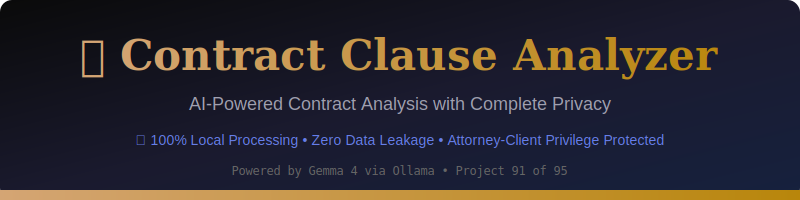
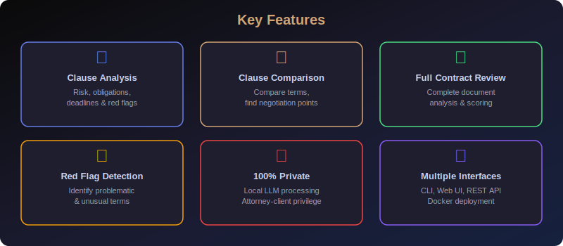

<div align="center">


**AI-powered contract clause analysis with complete privacy using local LLMs.**

🔒 **100% Local Processing** • **Zero Data Leakage** • **Attorney-Client Privilege Protected**

</div>

---

> [!IMPORTANT]
> **🔒 Privacy Guarantee**: This tool runs entirely on your local machine using Ollama and Gemma 4.
> No contract text, analysis results, or any data ever leaves your computer. Your documents remain
> completely private, making this tool safe for privileged legal documents, NDAs, and sensitive
> business agreements. Attorney-client privilege is fully protected.

---

## 📖 Table of Contents

- [✨ Features](#-features)
- [🏗️ Architecture](#️-architecture)
- [🚀 Quick Start](#-quick-start)
- [🐳 Docker Deployment](#-docker-deployment)
- [⌨️ CLI Usage](#️-cli-usage)
- [🖥️ Web UI](#️-web-ui)
- [🔌 API Documentation](#-api-documentation)
- [⚙️ Configuration](#️-configuration)
- [📋 Sample Clauses](#-sample-clauses)
- [🧪 Testing](#-testing)
- [📁 Project Structure](#-project-structure)
- [🔒 Privacy & Security](#-privacy--security)
- [⚖️ Legal Disclaimer](#️-legal-disclaimer)
- [🤝 Contributing](#-contributing)
- [📄 License](#-license)
- [🙏 Acknowledgments](#-acknowledgments)

---

## ✨ Features



### 📋 Clause Analysis
Paste any contract clause and receive a detailed breakdown including:
- **Clause Type Classification** — Automatically categorizes clauses (indemnification, termination, confidentiality, non-compete, IP, warranty, force majeure, and more)
- **Risk Level Assessment** — Color-coded risk ratings: 🟢 Low, 🟡 Medium, 🔴 High, 🚨 Critical
- **Obligation Extraction** — Lists all duties and obligations imposed on each party
- **Deadline Detection** — Identifies time-sensitive requirements and notice periods
- **Red Flag Identification** — Highlights problematic, one-sided, or unusual terms
- **Recommendations** — Suggests improvements and negotiation points

### 🔍 Clause Comparison
Compare two contract clauses side-by-side to:
- Identify key differences between terms
- Determine which clause favors which party
- Generate negotiation talking points
- Get overall recommendations for clause selection

### 📄 Full Contract Review
Upload or paste an entire contract document for comprehensive analysis:
- Automatic clause segmentation and classification
- Overall risk score for the entire agreement
- Per-clause risk breakdown with expandable details
- Aggregate statistics (total obligations, deadlines, red flags)
- Executive summary of findings

### 🚩 Red Flag Detection
Automatically identifies problematic contract provisions:
- One-sided indemnification clauses
- Overly broad non-compete restrictions
- Missing standard protections (limitation of liability, force majeure)
- Ambiguous language that could be exploited
- Unusual or non-standard terms
- Excessive penalty or termination provisions

### 🔒 Complete Privacy
- **100% Local Processing** — All AI inference runs on your machine via Ollama
- **Zero Network Calls** — No data is sent to any external server or API
- **No Telemetry** — Zero data collection, tracking, or logging of contract content
- **Attorney-Client Privilege** — Safe for privileged legal documents
- **Air-Gap Compatible** — Works without any internet connection

### ⚡ Multiple Interfaces
- **CLI** — Rich terminal interface with Click + Rich for power users
- **Web UI** — Professional Streamlit dashboard with dark theme
- **REST API** — FastAPI with auto-generated Swagger documentation
- **Docker** — One-command deployment with docker-compose

---

## 🏗️ Architecture


The Contract Clause Analyzer follows a layered architecture designed for privacy and modularity:

| Layer | Component | Description |
|-------|-----------|-------------|
| **Interface** | Streamlit UI (`:8501`) | Professional web dashboard with dark theme |
| **Interface** | FastAPI (`:8000`) | RESTful API with Swagger documentation |
| **Interface** | CLI (Click + Rich) | Terminal interface with rich formatting |
| **Core** | Analysis Engine | Clause parsing, risk assessment, comparison logic |
| **LLM** | Gemma 4 via Ollama | Local language model for AI-powered analysis |

All components communicate exclusively with the local Ollama instance. No external network calls are made at any point in the pipeline.

---

## 🚀 Quick Start

### Prerequisites

| Requirement | Version | Purpose |
|-------------|---------|---------|
| **Python** | 3.10+ | Runtime |
| **Ollama** | Latest | Local LLM inference |
| **Gemma 4** | Latest | AI model for analysis |

### Step 1: Install Ollama

```bash
# macOS / Linux
curl -fsSL https://ollama.com/install.sh | sh

# Windows
# Download from https://ollama.com/download
```

### Step 2: Pull the Gemma 4 Model

```bash
ollama pull gemma4:latest
```

### Step 3: Start Ollama

```bash
ollama serve
```

### Step 4: Clone and Install

```bash
# Navigate to the project
cd 91-contract-clause-analyzer

# Create a virtual environment (recommended)
python -m venv venv
source venv/bin/activate  # Linux/macOS
# or: venv\Scripts\activate  # Windows

# Install dependencies
pip install -r requirements.txt

# Or install as editable package
pip install -e ".[dev]"
```

### Step 5: Run

```bash
# CLI
python -m contract_analyzer.cli analyze

# Web UI
streamlit run src/contract_analyzer/web_ui.py

# REST API
uvicorn src.contract_analyzer.api:app --host 0.0.0.0 --port 8000
```

---

## 🐳 Docker Deployment

### Quick Start with Docker Compose

```bash
# Build and start all services (app + API + Ollama)
docker-compose up -d

# Pull the Gemma 4 model inside the Ollama container
docker-compose exec ollama ollama pull gemma4:latest

# Access the services
# Web UI:  http://localhost:8501
# API:     http://localhost:8000
# Swagger: http://localhost:8000/docs
```

### Docker Compose Services

| Service | Port | Description |
|---------|------|-------------|
| `app` | `8501` | Streamlit Web UI |
| `api` | `8000` | FastAPI REST API |
| `ollama` | `11434` | Ollama LLM Server |

### Build Standalone Docker Image

```bash
# Build the image
docker build -t contract-clause-analyzer .

# Run with host Ollama
docker run -p 8501:8501 \
  -e OLLAMA_HOST=http://host.docker.internal:11434 \
  contract-clause-analyzer
```

### Manage Docker Services

```bash
# View logs
docker-compose logs -f app

# Stop all services
docker-compose down

# Rebuild after changes
docker-compose up -d --build
```

---

## ⌨️ CLI Usage

The CLI provides a rich terminal interface powered by Click and Rich.

### Available Commands

| Command | Description |
|---------|-------------|
| `analyze` | Analyze a single contract clause |
| `full-analysis` | Analyze a complete contract document |
| `compare` | Compare two contract clauses |
| `samples` | Show sample clauses for testing |
| `disclaimer` | Show legal disclaimer |

### Analyze a Clause

```bash
# Interactive mode (paste clause when prompted)
python -m contract_analyzer.cli analyze

# From text argument
python -m contract_analyzer.cli analyze -t "Party A shall indemnify Party B..."

# From file
python -m contract_analyzer.cli analyze -f clause.txt

# With specific model
python -m contract_analyzer.cli analyze -f clause.txt -m gemma4
```

### Analyze a Full Contract

```bash
python -m contract_analyzer.cli full-analysis -f contract.txt
```

### Compare Two Clauses

```bash
python -m contract_analyzer.cli compare
```

### View Sample Clauses

```bash
python -m contract_analyzer.cli samples
```

### CLI Output Example

```
╭────────────── 📋 Clause Analysis ──────────────╮
│ Type: Non Compete                               │
│ Risk: 🔴 HIGH                                   │
│ Summary: Overly broad non-compete with           │
│ excessive geographic and temporal scope           │
╰─────────────────────────────────────────────────╯

        🚩 Red Flags
┏━━━━┳━━━━━━━━━━━━━━━━━━━━━━━━━━━━━━━━━━━━━━━━┓
┃ #  ┃ Red Flag                                ┃
┡━━━━╇━━━━━━━━━━━━━━━━━━━━━━━━━━━━━━━━━━━━━━━━┩
│ 1  │ 2-year restriction is excessive         │
│ 2  │ 100-mile radius is overly broad         │
│ 3  │ Includes employee non-solicitation      │
└────┴────────────────────────────────────────┘
```

---

## 🖥️ Web UI

The Streamlit-based web UI provides a professional dashboard with a dark theme optimized for legal professionals.

### Launch the Web UI

```bash
streamlit run src/contract_analyzer/web_ui.py
```

Then open [http://localhost:8501](http://localhost:8501) in your browser.

### Web UI Tabs

| Tab | Description |
|-----|-------------|
| **📋 Clause Analysis** | Paste a single clause for detailed analysis |
| **📄 Full Contract** | Upload or paste an entire contract document |
| **🔍 Compare Clauses** | Side-by-side clause comparison |

### Features

- **Dark theme** optimized for extended reading sessions
- **Sample clause loader** in the sidebar for quick testing
- **File upload** support for `.txt` contract files
- **Color-coded risk levels** with emoji indicators
- **Expandable clause details** for full contract analysis
- **Real-time analysis** with loading spinners
- **Model selector** — choose between different Ollama models

---

## 🔌 API Documentation

The FastAPI REST API provides programmatic access to all analysis features with auto-generated Swagger documentation.

### Base URL

```
http://localhost:8000
```

### Swagger UI

Open [http://localhost:8000/docs](http://localhost:8000/docs) for interactive API documentation.

### Endpoints

#### Health Check

```bash
GET /health
```

```bash
curl http://localhost:8000/health
```

**Response:**
```json
{
  "status": "healthy",
  "ollama": "connected",
  "service": "contract-clause-analyzer"
}
```

#### Analyze a Clause

```bash
POST /analyze/clause
```

```bash
curl -X POST http://localhost:8000/analyze/clause \
  -H "Content-Type: application/json" \
  -d '{
    "text": "Party A shall indemnify, defend, and hold harmless Party B from all claims arising out of Party A'\''s breach of this Agreement.",
    "model": "gemma4:latest"
  }'
```

**Response:**
```json
{
  "clause_type": "indemnification",
  "risk_level": "medium",
  "summary": "Standard one-way indemnification clause",
  "obligations": ["Party A must indemnify Party B", "Party A must defend Party B"],
  "deadlines": [],
  "red_flags": ["One-sided indemnification"],
  "recommendations": ["Consider mutual indemnification"],
  "key_terms": ["indemnify", "defend", "hold harmless"]
}
```

#### Analyze a Full Contract

```bash
POST /analyze/contract
```

```bash
curl -X POST http://localhost:8000/analyze/contract \
  -H "Content-Type: application/json" \
  -d '{
    "text": "FULL CONTRACT TEXT HERE...",
    "model": "gemma4:latest"
  }'
```

**Response:**
```json
{
  "title": "Service Agreement",
  "overall_risk": "medium",
  "summary": "Standard service agreement with some high-risk clauses",
  "total_clauses": 5,
  "high_risk_count": 1,
  "obligations_count": 8,
  "deadlines_count": 3,
  "red_flags_count": 2,
  "clauses": [...]
}
```

#### Compare Two Clauses

```bash
POST /compare
```

```bash
curl -X POST http://localhost:8000/compare \
  -H "Content-Type: application/json" \
  -d '{
    "clause_a": "First clause text...",
    "clause_b": "Second clause text...",
    "model": "gemma4:latest"
  }'
```

**Response:**
```json
{
  "differences": ["Duration differs: 1 year vs 2 years"],
  "favorable_to_party_a": ["Shorter restriction period"],
  "favorable_to_party_b": ["Broader protection scope"],
  "negotiation_points": ["Consider 18-month compromise"],
  "recommendation": "Negotiate a middle ground on duration"
}
```

#### Get Sample Clauses

```bash
GET /samples
```

```bash
curl http://localhost:8000/samples
```

---

## ⚙️ Configuration

### config.yaml

The main configuration file controls LLM settings and application behavior:

```yaml
app:
  name: "Contract Clause Analyzer"
  version: "1.0.0"

llm:
  model: "gemma4:latest"
  temperature: 0.3        # Lower = more deterministic analysis
  max_tokens: 4096        # Maximum response length
  ollama_host: "http://localhost:11434"

analysis:
  default_risk_threshold: "medium"
  max_clause_length: 10000

logging:
  level: "INFO"
  format: "%(asctime)s - %(name)s - %(levelname)s - %(message)s"
```

### Environment Variables

Environment variables override `config.yaml` settings:

| Variable | Default | Description |
|----------|---------|-------------|
| `OLLAMA_HOST` | `http://localhost:11434` | Ollama server URL |
| `OLLAMA_MODEL` | `gemma4:latest` | Default model to use |
| `LOG_LEVEL` | `INFO` | Logging verbosity |

### .env File

Copy `.env.example` to `.env` for local configuration:

```bash
cp .env.example .env
```

---

## 📋 Sample Clauses

The tool includes 5 built-in sample clauses for testing:

| Sample | Type | Typical Risk |
|--------|------|-------------|
| **Indemnification** | One-way indemnification with attorney's fees | 🟡 Medium |
| **Termination** | 30-day notice with immediate breach termination | 🟢 Low |
| **Non-Compete** | 2-year, 100-mile radius restriction | 🔴 High |
| **Limitation of Liability** | 12-month cap, no consequential damages | 🟡 Medium |
| **Confidentiality** | 5-year survival, reasonable care standard | 🟢 Low |

### Load Samples via CLI

```bash
python -m contract_analyzer.cli samples
```

### Load Samples via API

```bash
curl http://localhost:8000/samples | python -m json.tool
```

### Load Samples in Web UI

Use the **Sample Clauses** dropdown in the sidebar to load any sample directly into the analysis form.

---

## 🧪 Testing

### Run All Tests

```bash
# Using pytest directly
python -m pytest tests/ -v --tb=short

# Using make
make test

# With coverage
python -m pytest tests/ -v --cov=src/ --cov-report=term-missing
```

### Test Structure

```
tests/
└── test_core.py
    ├── TestParseJsonResponse      # JSON parsing edge cases
    ├── TestRiskHelpers             # Risk color/emoji mapping
    ├── TestAnalyzeClause           # Single clause analysis (mocked LLM)
    ├── TestAnalyzeContract         # Full contract analysis (mocked LLM)
    ├── TestCompareClause           # Clause comparison (mocked LLM)
    └── TestDataStructures          # Data classes and enums
```

### Syntax Check

```bash
make lint
```

This compiles all Python source files to verify syntax correctness without running them.

---

## 📁 Project Structure

```
91-contract-clause-analyzer/
├── src/contract_analyzer/          # Main application package
│   ├── __init__.py                 # Package metadata and version
│   ├── core.py                     # Core analysis logic, prompts, data models
│   ├── cli.py                      # Click CLI with Rich formatting
│   ├── web_ui.py                   # Streamlit web dashboard
│   ├── api.py                      # FastAPI REST API
│   └── config.py                   # Configuration management
├── tests/                          # Test suite
│   └── test_core.py                # Core module tests with mocked LLM
├── examples/                       # Usage examples
│   ├── demo.py                     # Interactive demo script
│   └── README.md                   # Example documentation
├── docs/images/                    # Documentation assets
│   ├── banner.svg                  # Project banner
│   ├── architecture.svg            # Architecture diagram
│   └── features.svg                # Features overview
├── .github/workflows/              # CI/CD
│   └── ci.yml                      # GitHub Actions pipeline
├── common/                         # Shared utilities
│   ├── __init__.py                 # Package init
│   └── llm_client.py               # Shared Ollama LLM client
├── config.yaml                     # Application configuration
├── setup.py                        # Package setup
├── requirements.txt                # Python dependencies
├── Makefile                        # Build automation
├── Dockerfile                      # Multi-stage Docker build
├── docker-compose.yml              # Full stack deployment
├── .dockerignore                   # Docker build exclusions
├── .env.example                    # Environment variable template
├── README.md                       # This file
├── CONTRIBUTING.md                 # Contribution guidelines
└── CHANGELOG.md                    # Version history
```

---

## 🔒 Privacy & Security

### Privacy Architecture

The Contract Clause Analyzer is designed from the ground up with privacy as the primary concern. This is critical for legal professionals handling privileged documents.

```
┌─────────────────────────────────────────────────┐
│              YOUR MACHINE (Air-Gapped OK)        │
│                                                   │
│  ┌─────────────┐     ┌──────────────────────┐   │
│  │  Contract    │────▶│  Contract Clause      │   │
│  │  Analyzer    │◀────│  Analyzer             │   │
│  │  (UI/CLI)    │     │  (Core Engine)        │   │
│  └─────────────┘     └──────────┬───────────┘   │
│                                  │               │
│                         ┌────────▼─────────┐     │
│                         │  Ollama + Gemma 4 │     │
│                         │  (localhost:11434) │     │
│                         └──────────────────┘     │
│                                                   │
│  ❌ No external API calls                        │
│  ❌ No cloud services                            │
│  ❌ No telemetry or analytics                    │
│  ❌ No data logging or storage                   │
│  ✅ 100% local processing                        │
│  ✅ Air-gap compatible                           │
│  ✅ Attorney-client privilege protected           │
└─────────────────────────────────────────────────┘
```

### Security Guarantees

| Guarantee | Details |
|-----------|---------|
| **No External API Calls** | The application only communicates with `localhost:11434` (Ollama). No DNS lookups, no HTTP calls to external services. |
| **No Data Persistence** | Contract text is processed in memory and immediately discarded. No logs, no databases, no file caching. |
| **No Telemetry** | Zero analytics, tracking, or usage reporting. No crash reports, no feature flags, no A/B testing. |
| **No Dependencies on Cloud** | Works completely offline. Install once, run forever without internet. |
| **Open Source** | Full source code available for audit. Verify every line of code that touches your data. |
| **Docker Isolation** | When using Docker, the application runs in an isolated container with no network access to external services. |

### For Law Firms

This tool is specifically designed for legal professionals who need:
- **Attorney-client privilege protection** — No risk of privilege waiver through third-party data sharing
- **Conflict check safety** — Contract details never leave your control
- **Regulatory compliance** — Meets data residency requirements by keeping all data local
- **Audit trail** — Open source code base allows complete audit of data handling

---

## ⚖️ Legal Disclaimer

> [!CAUTION]
> **This tool provides AI-assisted contract analysis for informational purposes only.**
>
> It is **NOT legal advice**. The analysis provided by this tool should not be relied upon
> as a substitute for professional legal counsel. Always consult with a qualified attorney
> before making legal decisions based on contract analysis.
>
> The developers of this tool make no warranties, express or implied, regarding the accuracy,
> completeness, or reliability of the analysis provided. Use at your own risk.
>
> This tool is designed to assist legal professionals in their work, not to replace their
> expertise and judgment.

---

## 🤝 Contributing

Contributions are welcome! Please see [CONTRIBUTING.md](CONTRIBUTING.md) for guidelines.

### Quick Start for Contributors

```bash
# Clone the repository
git clone https://github.com/kennedyraju55/90-local-llm-projects.git
cd 90-local-llm-projects/91-contract-clause-analyzer

# Set up development environment
python -m venv venv
source venv/bin/activate
pip install -e ".[dev]"

# Run tests
pytest tests/ -v

# Check syntax
make lint
```

### Privacy Commitment for Contributors

All contributions must maintain the privacy-first architecture:
- ❌ No external API calls
- ❌ No data collection or telemetry
- ❌ No logging of user contract content
- ✅ All processing must remain local

---

## 📄 License

This project is licensed under the **MIT License**. See the [LICENSE](../LICENSE) file for details.

---

## 🙏 Acknowledgments

- **[Ollama](https://ollama.com/)** — Local LLM inference engine that makes privacy-first AI possible
- **[Google Gemma 4](https://ai.google.dev/gemma)** — Powerful open-weight language model for contract analysis
- **[Streamlit](https://streamlit.io/)** — Rapid web UI development for data applications
- **[FastAPI](https://fastapi.tiangolo.com/)** — Modern, high-performance API framework
- **[Click](https://click.palletsprojects.com/)** — Composable command-line interface toolkit
- **[Rich](https://rich.readthedocs.io/)** — Beautiful terminal formatting for Python
- **[pytest](https://pytest.org/)** — Testing framework that makes testing enjoyable

---

<div align="center">

**⚖️ Contract Clause Analyzer** — *Project 91 of 95 in the Local LLM Projects Collection*

🔒 Built with privacy first. No data ever leaves your machine.

Made with ❤️ by [Nrk Raju Guthikonda](https://github.com/kennedyraju55)

</div>
