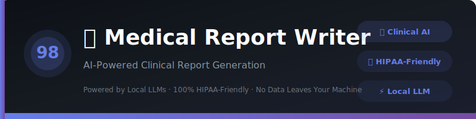
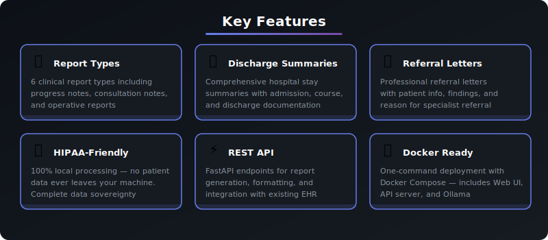
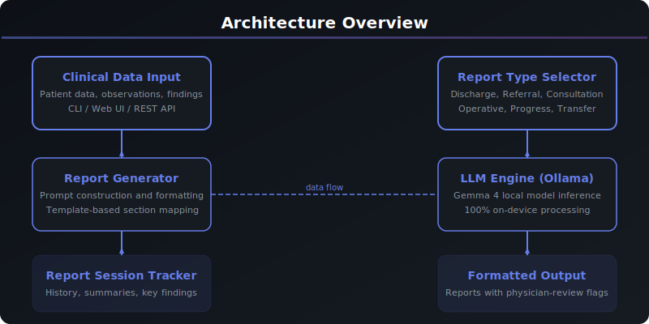

<div align="center">



# 🏥 Medical Report Writer

### AI-Powered Clinical Report Generation

[](https://python.org)
[](https://ollama.com)
[](LICENSE)
[]()
[]()
[]()
[]()

</div>

---

> ## ⚠️ Physician Review Required
>
> **All reports generated by this tool are AI-drafted documents that MUST be reviewed, verified, and approved by a licensed physician before clinical use.** This tool is a drafting assistant — NOT a replacement for clinical judgment.
>
> - 📋 Generated reports may contain **inaccuracies or omissions**
> - 👨‍⚕️ The treating physician is **solely responsible** for the final report content
> - 🔒 All data is processed **100% locally** — no patient data leaves your machine
> - ✅ HIPAA-friendly architecture — no cloud data transmission
>
> *The developers assume no liability for any clinical decisions based on AI-generated reports.*

---

<div align="center">

[✨ Features](#-features) · [🚀 Quick Start](#-quick-start) · [💻 CLI Reference](#-cli-reference) · [🏗️ Architecture](#️-architecture) · [📖 API Reference](#-api-reference) · [🔒 HIPAA](#-hipaa-compliance) · [❓ FAQ](#-faq)

</div>

---

## 📋 Overview

An intelligent clinical report generation tool that leverages local LLMs to draft discharge summaries, referral letters, consultation notes, operative reports, progress notes, and transfer summaries — all running privately on your machine with zero data transmission.

Built as part of the **Local LLM Projects** series (Project #98/90), this tool demonstrates how AI can assist physicians with clinical documentation while maintaining complete data privacy through local model inference.

### Why This Project?

| | Feature | Description |
|---|---------|-------------|
| 🔒 | **100% HIPAA-Friendly** | All patient data stays on your machine — no cloud uploads ever |
| 📄 | **6 Report Types** | Discharge summaries, referral letters, consultation notes, and more |
| 🏥 | **Discharge Summaries** | Comprehensive hospital stay documentation from structured data |
| 📨 | **Referral Letters** | Professional specialist referral letters with clinical findings |
| ⚡ | **REST API** | FastAPI endpoints for integration with existing clinical systems |
| 🐳 | **Docker Ready** | One-command deployment with Web UI, API, and Ollama |

---

## ✨ Features

<div align="center">



</div>

| Feature | Details |
|---------|---------|
| **Report Types** | 6 clinical report types: discharge summary, referral letter, consultation note, operative report, progress note, transfer summary |
| **Discharge Summaries** | Structured generation from admission data, hospital course, and discharge information |
| **Referral Letters** | Professional letters with patient info, reason, findings, and referring physician |
| **Report Formatting** | Three formatting styles: standard, compact, and detailed |
| **Key Findings Extraction** | Automatic extraction of diagnoses, findings, and action items from reports |
| **Session Tracking** | Track all generated reports with timestamps and report types |
| **HIPAA-Friendly** | 100% local processing — no patient data leaves your machine |
| **Physician Review Flags** | AI marks uncertain areas with [PHYSICIAN TO VERIFY] tags |

---

## 🚀 Quick Start

### Prerequisites

| Requirement | Version | Purpose |
|-------------|---------|---------|
| **Python** | 3.10+ | Runtime environment |
| **Ollama** | Latest | Local LLM inference engine |
| **Gemma 4** | Latest | AI model (downloaded via Ollama) |

### Installation

```bash
# 1. Clone the repository
git clone https://github.com/kennedyraju55/90-local-llm-projects.git
cd 90-local-llm-projects/98-medical-report-writer

# 2. Create virtual environment
python -m venv venv
source venv/bin/activate  # Linux/Mac
# or
.\venv\Scripts\activate  # Windows

# 3. Install dependencies
pip install -r requirements.txt

# 4. Ensure Ollama is running with Gemma 4
ollama pull gemma4
ollama serve
```

### First Run

```bash
# Verify installation
medical-report-writer --help

# List available report types
medical-report-writer templates

# Generate a progress note
medical-report-writer generate \
  --type progress_note \
  --data "Patient presents with productive cough x 3 days, fever 101.2F, diminished breath sounds right lower lobe"
```

### Expected Output

```
╭─────────────────────────────────────────────────────────────╮
│  ⚕️  Physician Review Required                              │
│  All reports MUST be reviewed by a licensed physician.       │
╰─────────────────────────────────────────────────────────────╯

⏳ Generating Progress Note...

╭─────────────────────────────────────────────────────────────╮
│  📄 Progress Note                                           │
│                                                             │
│  SUBJECTIVE:                                                │
│  Patient reports productive cough x 3 days...               │
│                                                             │
│  OBJECTIVE:                                                 │
│  Temp: 101.2°F, Lungs: diminished breath sounds RLL...      │
│                                                             │
│  ASSESSMENT:                                                │
│  Community-acquired pneumonia [PHYSICIAN TO VERIFY]          │
│                                                             │
│  PLAN:                                                      │
│  1. Chest X-ray PA and lateral                               │
│  2. CBC with differential, BMP, blood cultures               │
│  ...                                                         │
│                                                             │
│  ⚠️  AI-drafted — requires physician review and signature    │
╰─────────────────────────────────────────────────────────────╯
```

---

## 🐳 Docker Deployment

Run this project instantly with Docker — no local Python setup needed!

### Quick Start with Docker

```bash
# Clone and start
git clone https://github.com/kennedyraju55/90-local-llm-projects.git
cd 90-local-llm-projects/98-medical-report-writer
docker compose up

# Access the services
# Web UI: http://localhost:8501
# REST API: http://localhost:8000
# API Docs: http://localhost:8000/docs
```

### Docker Commands

| Command | Description |
|---------|-------------|
| `docker compose up` | Start Web UI + API + Ollama |
| `docker compose up -d` | Start in background |
| `docker compose down` | Stop all services |
| `docker compose logs -f` | View live logs |
| `docker compose build --no-cache` | Rebuild from scratch |

### Service Architecture

```
┌─────────────────┐     ┌─────────────────┐     ┌─────────────────┐
│   Streamlit UI  │     │   FastAPI API    │     │   Ollama + LLM  │
│   Port 8501     │────▶│   Port 8000     │────▶│   Port 11434    │
└─────────────────┘     └─────────────────┘     └─────────────────┘
```

> **Note:** First run will download the Gemma 4 model (~5GB). Subsequent starts are instant.

---

## 💻 CLI Reference

| Command | Description |
|---------|-------------|
| `generate` | Generate a medical report from clinical data |
| `discharge` | Generate a discharge summary |
| `referral` | Generate a referral letter |
| `templates` | List all available report types |

### generate

```bash
# Generate a progress note
medical-report-writer generate \
  --type progress_note \
  --data "Patient data here..."

# Generate a consultation note with demographics
medical-report-writer generate \
  --type consultation_note \
  --data "Referred for evaluation of..." \
  --demographics "John Doe, 65M, MRN-12345"

# Generate an operative report
medical-report-writer generate \
  --type operative_report \
  --data "Right knee arthroscopy performed..."
```

### discharge

```bash
medical-report-writer discharge \
  --admission "Admitted 2024-01-15 for community-acquired pneumonia" \
  --course "IV ceftriaxone + azithromycin x 5 days, supplemental O2 2L NC" \
  --discharge-info "Discharge with amoxicillin-clavulanate 875mg BID x 7 days, follow-up PCP 2 weeks"
```

### referral

```bash
medical-report-writer referral \
  --patient "Jane Smith, 52F, PMH: HTN, DM2" \
  --reason "Persistent proteinuria and declining eGFR" \
  --findings "eGFR 45, urine protein/creatinine ratio 1.2, BP 148/92" \
  --physician "Dr. Williams"
```

### templates

```bash
medical-report-writer templates
```

### Global Options

```bash
medical-report-writer --help          # Show all commands and options
```

---

## 🌐 Web UI

This project includes a Streamlit web interface for browser-based report generation.

```bash
# Start the web server
streamlit run src/medical_report_writer/web_ui.py

# Open in browser
# http://localhost:8501
```

| Feature | Description |
|---------|-------------|
| **Report Type Selector** | Choose from 6 clinical report types |
| **Clinical Data Input** | Free-text area for clinical observations |
| **Patient Demographics** | Optional name, age, gender, MRN fields |
| **Discharge Summary Tab** | Structured admission/course/discharge fields |
| **Referral Letter Tab** | Patient info, reason, findings, physician fields |
| **Copy Button** | Copy generated reports for pasting into EHR |
| **Session History** | Browse all reports generated in current session |
| **Dark Theme** | Professional dark medical interface |

> ⚠️ **Note**: The web UI connects to your local Ollama instance. No data leaves your machine.

---

## ⚡ REST API

Every report type is available via FastAPI REST endpoints with auto-generated docs.

### Start the API Server

```bash
# Run directly
uvicorn src.medical_report_writer.api:app --reload --port 8000

# Or with Docker
docker compose up
```

### API Endpoints

| Method | Endpoint | Description |
|--------|----------|-------------|
| `GET` | `/health` | Health check |
| `POST` | `/generate` | Generate any report type |
| `POST` | `/discharge-summary` | Generate discharge summary |
| `POST` | `/referral-letter` | Generate referral letter |
| `POST` | `/format` | Format raw report text |
| `GET` | `/report-types` | List available report types |
| `GET` | `/disclaimer` | Get medical disclaimer |
| `GET` | `/docs` | Interactive Swagger UI |
| `GET` | `/redoc` | ReDoc documentation |

### Example Requests

#### Generate a Report

```bash
curl -X POST http://localhost:8000/generate \
  -H "Content-Type: application/json" \
  -d '{
    "clinical_data": "Patient presents with acute onset chest pain, diaphoresis, troponin elevated at 2.4",
    "report_type": "progress_note"
  }'
```

#### Generate a Discharge Summary

```bash
curl -X POST http://localhost:8000/discharge-summary \
  -H "Content-Type: application/json" \
  -d '{
    "admission_data": "Admitted 2024-03-10 for NSTEMI",
    "hospital_course": "Cardiac catheterization with PCI to LAD, dual antiplatelet therapy initiated",
    "discharge_info": "Discharge on aspirin 81mg, clopidogrel 75mg, atorvastatin 80mg. Cardiac rehab referral."
  }'
```

#### Generate a Referral Letter

```bash
curl -X POST http://localhost:8000/referral-letter \
  -H "Content-Type: application/json" \
  -d '{
    "patient_info": "Robert Johnson, 68M, PMH: CAD, HTN, DM2",
    "reason": "New onset atrial fibrillation with rapid ventricular response",
    "clinical_findings": "ECG: AFib with RVR, rate 142. Echo: EF 45%, mild MR. CHA2DS2-VASc: 4",
    "requesting_physician": "Dr. Martinez"
  }'
```

#### Format a Report

```bash
curl -X POST http://localhost:8000/format \
  -H "Content-Type: application/json" \
  -d '{
    "raw_report": "ASSESSMENT\n\n\n\nPneumonia\n\n\n\nPLAN\n\n\n\nAntibiotics",
    "style": "compact"
  }'
```

#### List Report Types

```bash
curl http://localhost:8000/report-types | python -m json.tool
```

> 📖 Visit `http://localhost:8000/docs` for the full interactive API documentation.

---

## 🏗️ Architecture

<div align="center">



</div>

### Project Structure

```
98-medical-report-writer/
├── src/
│   └── medical_report_writer/
│       ├── __init__.py          # Package initialization
│       ├── config.py            # Configuration loader
│       ├── core.py              # Core report generation logic
│       ├── cli.py               # Click CLI commands
│       ├── web_ui.py            # Streamlit web interface
│       └── api.py               # FastAPI REST API
├── tests/
│   └── test_core.py             # Comprehensive test suite
├── common/
│   ├── __init__.py
│   └── llm_client.py            # Shared Ollama client
├── examples/
│   ├── demo.py                  # Demo script
│   └── README.md                # Examples documentation
├── docs/
│   └── images/
│       ├── banner.svg           # Project banner
│       ├── architecture.svg     # Architecture diagram
│       └── features.svg         # Feature grid
├── .github/workflows/
│   └── ci.yml                   # CI/CD pipeline
├── config.yaml                  # Model configuration
├── requirements.txt             # Python dependencies
├── setup.py                     # Package setup
├── Dockerfile                   # Container definition
├── docker-compose.yml           # Multi-service deployment
└── README.md                    # This file
```

### Data Flow

```
Clinical Data → CLI/Web/API → Report Generator → LLM (Ollama/Gemma 4) → Draft Report
                                     ↓                                        ↓
                              Report Type Templates                  [PHYSICIAN TO VERIFY] flags
                              Section Formatting                     Physician Review Required
```

### Technology Stack

| Layer | Technology | Purpose |
|-------|-----------|---------|
| **CLI** | Click | Command-line interface framework |
| **UI** | Rich | Beautiful terminal formatting |
| **Web** | Streamlit | Browser-based interface |
| **API** | FastAPI | REST API with Swagger |
| **AI** | Ollama + Gemma 4 | Local LLM inference |
| **Config** | YAML | Configuration management |
| **Testing** | pytest | Unit and integration tests |
| **Deploy** | Docker | Container deployment |

---

## 📖 API Reference

### Core Functions

```python
from medical_report_writer.core import (
    generate_report,
    generate_discharge_summary,
    generate_referral_letter,
    format_report,
    extract_key_findings,
    REPORT_TYPES,
)

# Generate any report type
report = generate_report(
    clinical_data="Patient presents with...",
    report_type="progress_note",
    patient_demographics="John Doe, 45M",
)

# Generate a discharge summary
summary = generate_discharge_summary(
    admission_data="Admitted 2024-01-15 for pneumonia",
    hospital_course="IV antibiotics x 5 days",
    discharge_info="Discharge with oral antibiotics",
)

# Generate a referral letter
letter = generate_referral_letter(
    patient_info="Jane Smith, 52F",
    reason="Persistent proteinuria",
    clinical_findings="eGFR 45, protein/creatinine 1.2",
    requesting_physician="Dr. Williams",
)

# Format a report
formatted = format_report(raw_text, "compact")

# Extract key findings
findings = extract_key_findings(report_text)
```

### Configuration

```yaml
# config.yaml
model: gemma4
temperature: 0.3
max_tokens: 3072
log_level: INFO
ollama_url: http://localhost:11434
```

### Environment Variables

| Variable | Default | Description |
|----------|---------|-------------|
| `OLLAMA_BASE_URL` | `http://localhost:11434` | Ollama API endpoint |
| `OLLAMA_MODEL` | `gemma4` | Default LLM model |
| `LOG_LEVEL` | `INFO` | Logging verbosity |

---

## 🔒 HIPAA Compliance

This tool is designed with HIPAA-friendly architecture:

### Privacy Architecture

| Aspect | Implementation |
|--------|---------------|
| **Data Processing** | 100% local — all LLM inference runs on your machine |
| **Data Transmission** | Zero network transmission of patient data |
| **Data Storage** | Session-only — no persistent storage of patient data |
| **Model Location** | Ollama runs locally with downloaded model weights |
| **API Communication** | Only localhost communication between services |

### Local vs Cloud Comparison

| Aspect | Local LLM (This Tool) | Cloud API |
|--------|----------------------|-----------|
| **Privacy** | ✅ 100% local — data never leaves your machine | ❌ Data sent to external servers |
| **HIPAA** | ✅ No data transmission concerns | ⚠️ BAA required, compliance risk |
| **Cost** | ✅ Free after setup | ❌ Pay per API call |
| **Internet** | ✅ Works offline | ❌ Requires connection |
| **Data Control** | ✅ Complete sovereignty | ❌ Third-party storage |
| **Audit Trail** | ✅ Full local control | ⚠️ Depends on provider |
| **Speed** | ⚡ Depends on hardware | ⚡ Generally fast |
| **Scalability** | ⚠️ Limited by hardware | ✅ Cloud-scale |

> 🔒 **For clinical data, local LLM inference eliminates the risk of PHI exposure through network transmission.**

### Best Practices

1. **Never transmit** generated reports over unsecured channels
2. **Always review** AI-generated reports before signing
3. **Document** that AI assistance was used in report generation
4. **Verify** all clinical findings, diagnoses, and medication details
5. **Use** institutional guidelines for AI-assisted documentation

---

## 🧪 Testing

```bash
# Run all tests
pytest

# Run with coverage report
pytest --cov=src/medical_report_writer --cov-report=html

# Run specific test file
pytest tests/test_core.py -v

# Run with verbose output
pytest -v --tb=short
```

### Test Categories

| Category | Tests | Description |
|----------|-------|-------------|
| **TestDisclaimer** | 3 | Disclaimer content validation |
| **TestReportTypes** | 3 | Report type definitions |
| **TestGenerateReport** | 4 | Report generation with mocked LLM |
| **TestDischargeSummary** | 2 | Discharge summary generation |
| **TestReferralLetter** | 2 | Referral letter generation |
| **TestReportSession** | 4 | Session tracking |
| **TestFormatReport** | 3 | Report formatting |
| **TestExtractKeyFindings** | 3 | Key findings extraction |
| **TestConfig** | 2 | Configuration loading |
| **TestDisplayDisclaimer** | 1 | Rich display function |

---

## 📋 Report Types Reference

<details>
<summary><strong>📄 Discharge Summary</strong></summary>

Comprehensive documentation of a patient's hospital stay including:
- Admission and discharge dates
- Admitting and principal diagnoses
- Hospital course narrative
- Procedures performed
- Discharge medications
- Follow-up instructions
- Physician signature line

</details>

<details>
<summary><strong>📨 Referral Letter</strong></summary>

Professional specialist referral including:
- Patient demographics and relevant history
- Reason for referral
- Clinical findings and test results
- Current medications
- Urgency level
- Referring physician information

</details>

<details>
<summary><strong>📝 Consultation Note</strong></summary>

Specialist consultation documentation:
- Reason for consultation
- History of present illness
- Review of systems
- Physical examination findings
- Assessment and plan
- Recommendations

</details>

<details>
<summary><strong>🔬 Operative Report</strong></summary>

Surgical procedure documentation:
- Pre/postoperative diagnoses
- Procedure performed
- Surgeon and anesthesia type
- Findings and technique
- Estimated blood loss
- Complications
- Specimen details

</details>

<details>
<summary><strong>📊 Progress Note</strong></summary>

SOAP-formatted clinical update:
- **S**ubjective: Patient's reported symptoms
- **O**bjective: Vital signs, exam findings, labs
- **A**ssessment: Clinical impression
- **P**lan: Treatment plan and orders

</details>

<details>
<summary><strong>🔄 Transfer Summary</strong></summary>

Inter-facility transfer documentation:
- Patient demographics
- Transfer reason
- Current diagnoses and treatment
- Medication list
- Pending results
- Receiving facility information

</details>

---

## ❓ FAQ

<details>
<summary><strong>Can this replace a physician writing reports?</strong></summary>
<br>

Absolutely NOT. This is a **drafting assistant** only. All generated reports MUST be reviewed, edited, and approved by a licensed physician. The AI may produce inaccurate or incomplete content. The treating physician bears full responsibility for the final report.

> ⚠️ **Reminder**: All reports require physician review and approval before clinical use.

</details>

<details>
<summary><strong>Is my patient data safe?</strong></summary>
<br>

Yes. All data is processed **100% locally** using Ollama. No patient data is ever transmitted to any external server. When you close the application, session data is cleared from memory.

> 🔒 HIPAA-friendly architecture with zero data transmission.

</details>

<details>
<summary><strong>What LLM model works best?</strong></summary>
<br>

We recommend **Gemma 4** for clinical report generation. Larger models (13B+) tend to produce more detailed and professionally structured reports. Medical-focused fine-tuned models may also work well.

</details>

<details>
<summary><strong>Can I integrate this with my EHR?</strong></summary>
<br>

Yes! The FastAPI REST API provides endpoints for all report types. You can integrate the API with your existing clinical workflow or EHR system. All communication stays on your local network.

</details>

<details>
<summary><strong>How do I add custom report templates?</strong></summary>
<br>

Add new entries to the `REPORT_TYPES` dictionary in `src/medical_report_writer/core.py`. Each entry needs a `name`, `description`, and `sections` field. The LLM will use these to structure the generated report.

</details>

<details>
<summary><strong>Can I use this offline?</strong></summary>
<br>

Yes! Once you have Ollama installed with a downloaded model, the entire application runs 100% offline with no internet required. This is ideal for clinical environments with restricted network access.

</details>

---

## 🤝 Contributing

Contributions are welcome! Please follow these steps:

1. **Fork** the repository
2. **Create** a feature branch (`git checkout -b feature/amazing-feature`)
3. **Commit** your changes (`git commit -m 'Add amazing feature'`)
4. **Push** to the branch (`git push origin feature/amazing-feature`)
5. **Open** a Pull Request

### Development Setup

```bash
# Clone your fork
git clone https://github.com/YOUR_USERNAME/90-local-llm-projects.git
cd 90-local-llm-projects/98-medical-report-writer

# Install dev dependencies
pip install -r requirements.txt
pip install pytest pytest-cov black flake8

# Run linting
black src/
flake8 src/

# Run tests before submitting
pytest -v
```

---

## 📄 License

This project is licensed under the MIT License — see the [LICENSE](LICENSE) file for details.

---

<div align="center">

### ⚠️ Important Reminder

**All reports generated by this tool are AI-drafted and MUST be reviewed,**
**verified, and approved by a licensed physician before clinical use.**
**The AI is a drafting assistant — NOT a replacement for clinical judgment.**

---

**Part of the [Local LLM Projects](https://github.com/kennedyraju55) Series — Project #98/90**

Built with ❤️ using [Ollama](https://ollama.com) · [Gemma 4](https://ai.google.dev/gemma) · [Python](https://python.org) · [FastAPI](https://fastapi.tiangolo.com) · [Streamlit](https://streamlit.io)

*🔒 100% HIPAA-Friendly — No patient data ever leaves your machine*

*⭐ Star this repo if you find it useful!*

</div>
