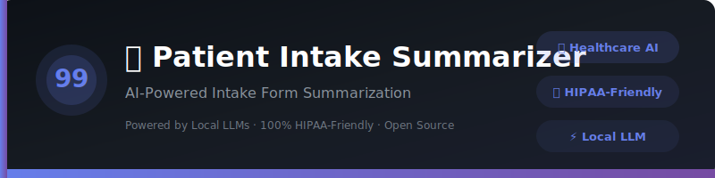
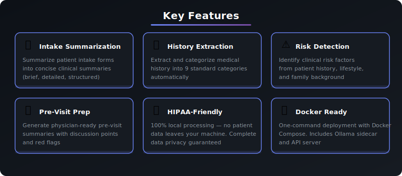
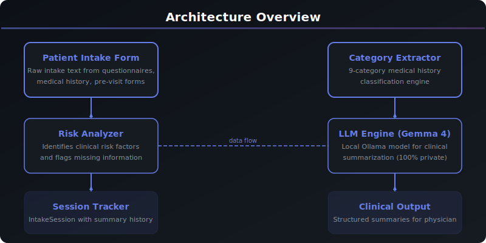

<div align="center">



# 🏥 Patient Intake Summarizer

### AI-Powered Intake Form Summarization

[](https://python.org)
[](https://ollama.com)
[](LICENSE)
[]()
[]()
[]()
[]()

</div>

---

> ## ⚠️ Clinical Disclaimer
>
> **This tool generates AI-assisted summaries for clinical decision support only. All output MUST be reviewed and verified by a licensed physician before use in patient care.**
>
> - 🏥 **AI-generated summaries are NOT a substitute for clinical judgment**
> - 📋 **Always verify extracted information against original intake documents**
> - 🔒 **100% local processing — no patient data leaves this machine (HIPAA-friendly)**
>
> *The developers assume no liability for clinical decisions based on this tool's output.*

---

<div align="center">

[✨ Features](#-features) · [🚀 Quick Start](#-quick-start) · [💻 CLI Reference](#-cli-reference) · [🏗️ Architecture](#️-architecture) · [📖 API Reference](#-api-reference) · [❓ FAQ](#-faq)

</div>

---

## 📋 Overview

An intelligent patient intake form summarizer that leverages local LLMs to process intake forms, extract medical history, identify risk factors, flag missing information, and generate pre-visit summaries — all running privately on your machine with zero data transmission.

Built as part of the **Local LLM Projects** series (Project #99/90), this tool demonstrates how AI can be applied to clinical workflow optimization while maintaining complete HIPAA compliance through local model inference.

### Why This Project?

| | Feature | Description |
|---|---------|-------------|
| 🔒 | **HIPAA-Friendly** | All patient data stays on your machine — no cloud uploads |
| 📋 | **Intake Summarization** | 3 summary formats: brief, detailed, structured |
| 🔍 | **History Extraction** | 9-category medical history classification |
| ⚠️ | **Risk Detection** | Automated clinical risk factor identification |
| 🩺 | **Pre-Visit Prep** | Physician-ready pre-visit summaries |
| ❓ | **Gap Detection** | Flag missing or incomplete intake information |

---

## ✨ Features

<div align="center">



</div>

| Feature | Details |
|---------|---------|
| **Intake Summarization** | Summarize patient intake forms into concise clinical summaries (brief, detailed, structured) |
| **History Extraction** | Extract and categorize medical history into 9 standardized categories |
| **Risk Detection** | Identify clinical risk factors from patient history, lifestyle, and family background |
| **Pre-Visit Prep** | Generate physician-ready pre-visit summaries with discussion points and red flags |
| **HIPAA-Friendly** | 100% local processing — no patient data leaves your machine |
| **Docker Ready** | One-command deployment with Docker Compose, Ollama sidecar, and API server |

---

## 🚀 Quick Start

### Prerequisites

| Requirement | Version | Purpose |
|-------------|---------|---------|
| **Python** | 3.10+ | Runtime environment |
| **Ollama** | Latest | Local LLM inference engine |
| **LLM Model** | gemma4 | AI model (downloaded via Ollama) |

### Installation

```bash
# 1. Clone the repository
git clone https://github.com/kennedyraju55/patient-intake-summarizer.git
cd 99-patient-intake-summarizer

# 2. Create virtual environment
python -m venv venv
source venv/bin/activate  # Linux/Mac
# or
.\venv\Scripts\activate  # Windows

# 3. Install dependencies
pip install -r requirements.txt

# 4. Ensure Ollama is running with a model
ollama pull gemma4
ollama serve
```

### First Run

```bash
# Verify installation
patient-intake-summarizer --help

# Summarize an intake form
patient-intake-summarizer summarize --text "Patient: Jane Doe, 52F. Chief Complaint: Lower back pain for 3 weeks. Medications: Metformin 500mg BID."
```

### Expected Output

```
╭─────────────────────────────────────────────────────────────╮
│  ⚠️  CLINICAL DISCLAIMER                                    │
│  AI-generated summaries require physician review.           │
│  No patient data leaves this machine.                       │
╰─────────────────────────────────────────────────────────────╯

⏳ Summarizing intake form (structured format)...

╭─────────────────────────────────────────────────────────────╮
│  📋 Intake Summary                                           │
│                                                             │
│  [AI-generated clinical summary]                            │
│                                                             │
│  ⚠️  This is an AI-generated summary requiring review.      │
╰─────────────────────────────────────────────────────────────╯
```

---

## 🐳 Docker Deployment

Run this project instantly with Docker — no local Python setup needed!

### Quick Start with Docker

```bash
# Clone and start
git clone https://github.com/kennedyraju55/patient-intake-summarizer.git
cd patient-intake-summarizer
docker compose up

# Access the web UI
open http://localhost:8501
```

### Docker Commands

| Command | Description |
|---------|-------------|
| `docker compose up` | Start app + Ollama |
| `docker compose up -d` | Start in background |
| `docker compose down` | Stop all services |
| `docker compose logs -f` | View live logs |
| `docker compose build --no-cache` | Rebuild from scratch |

### Architecture

```
┌─────────────────┐     ┌─────────────────┐
│   Streamlit UI  │────▶│   Ollama + LLM  │
│   Port 8501     │     │   Port 11434    │
└─────────────────┘     └─────────────────┘
        │
┌─────────────────┐
│   FastAPI API   │
│   Port 8000     │
└─────────────────┘
```

> **Note:** First run will download the Gemma 4 model (~5GB). Subsequent starts are instant.

---

## ⚡ REST API

Every project includes a FastAPI REST API with auto-generated docs.

### Start the API Server

```bash
# Run directly
uvicorn src.patient_intake_summarizer.api:app --reload --port 8000

# Or with Docker
docker compose up
```

### API Endpoints

| Method | Endpoint | Description |
|--------|----------|-------------|
| `GET` | `/health` | Health check |
| `POST` | `/summarize` | Summarize intake form text |
| `POST` | `/extract-history` | Extract categorized medical history |
| `POST` | `/pre-visit-summary` | Generate pre-visit summary |
| `POST` | `/risk-factors` | Identify clinical risk factors |
| `POST` | `/missing-info` | Flag missing intake information |
| `GET` | `/categories` | List standard intake categories |
| `GET` | `/disclaimer` | Get clinical disclaimer |
| `GET` | `/docs` | Interactive Swagger UI |
| `GET` | `/redoc` | ReDoc documentation |

### Example Request

```bash
curl -X POST http://localhost:8000/summarize \
  -H "Content-Type: application/json" \
  -d '{
    "intake_text": "Patient: Jane Doe, 52F. Chief Complaint: Lower back pain.",
    "summary_format": "structured",
    "focus_areas": ["chief_complaint", "medical_history"]
  }'
```

> 📖 Visit `http://localhost:8000/docs` for the full interactive API documentation.

---

## 💻 CLI Reference

| Command | Description |
|---------|-------------|
| `summarize` | Summarize intake form text into a clinical summary |
| `extract` | Extract and categorize medical history |
| `pre-visit` | Generate pre-visit summary for physician |
| `risks` | Identify clinical risk factors |
| `missing` | Flag missing or incomplete information |

### summarize

```bash
patient-intake-summarizer summarize --text "Patient intake text here" --format structured
patient-intake-summarizer summarize -t "intake text" -f brief --focus demographics --focus medications
```

### extract

```bash
patient-intake-summarizer extract --text "Patient intake form text here"
```

### pre-visit

```bash
patient-intake-summarizer pre-visit --text "intake text" --type follow-up
```

### risks

```bash
patient-intake-summarizer risks --text "Patient: 65M, smoker, family history of MI"
```

### missing

```bash
patient-intake-summarizer missing --text "Patient: Jane Doe, 52F. Chief Complaint: Back pain."
```

### Global Options

```bash
patient-intake-summarizer --help          # Show all commands and options
```

---

## 🌐 Web UI

This project includes a Streamlit-based web interface for browser-based interaction.

```bash
# Start the web server
streamlit run src/patient_intake_summarizer/web_ui.py

# Open in browser
# http://localhost:8501
```

| Feature | Description |
|---------|-------------|
| **Dark Theme** | Professional clinical dark theme with gradient accents |
| **Multiple Actions** | Summarize, extract, pre-visit, risk analysis, missing info |
| **Focus Areas** | Checkbox-based category selection for targeted summaries |
| **Format Selector** | Choose between brief, detailed, and structured formats |
| **Session History** | Track all summaries with timestamps and metadata |
| **Risk Panel** | Visual risk factor alerts and missing info notifications |

> ⚠️ **Note**: The web UI connects to your local Ollama instance. No data leaves your machine.

---

## 🏗️ Architecture

<div align="center">



</div>

### Project Structure

```
99-patient-intake-summarizer/
├── src/
│   └── patient_intake_summarizer/
│       ├── __init__.py          # Package metadata (v1.0.0)
│       ├── config.py            # Configuration loader
│       ├── core.py              # Core summarization logic
│       ├── cli.py               # Click CLI commands
│       ├── web_ui.py            # Streamlit web interface
│       └── api.py               # FastAPI REST API
├── common/
│   ├── __init__.py
│   └── llm_client.py           # Shared Ollama client
├── tests/
│   └── test_core.py            # Unit tests (15+ tests)
├── examples/
│   ├── demo.py                 # Demo script
│   └── README.md               # Example documentation
├── docs/images/
│   ├── banner.svg              # Project banner
│   ├── architecture.svg        # Architecture diagram
│   └── features.svg            # Feature overview
├── .github/workflows/
│   └── ci.yml                  # GitHub Actions CI/CD
├── config.yaml                 # Model configuration
├── setup.py                    # Package setup
├── requirements.txt            # Dependencies
├── Makefile                    # Development tasks
├── Dockerfile                  # Multi-stage Docker build
├── docker-compose.yml          # Container orchestration
├── .dockerignore               # Docker ignore
├── .env.example                # Environment template
├── README.md                   # This file
├── CONTRIBUTING.md             # Contribution guidelines
└── CHANGELOG.md                # Version history
```

### Data Flow

```
Patient Intake Form → CLI/Web/API → Core Engine → LLM (Ollama/Gemma 4) → Clinical Summary
                                         ↓
                                   9-Category Extractor
                                   Risk Factor Analyzer
                                   Missing Info Flagger
                                   Pre-Visit Generator
```

### Technology Stack

| Layer | Technology | Purpose |
|-------|-----------|---------|
| **CLI** | Click | Command-line interface framework |
| **UI** | Rich | Beautiful terminal formatting |
| **Web** | Streamlit | Browser-based interface |
| **API** | FastAPI | REST API with auto docs |
| **AI** | Ollama + Gemma 4 | Local LLM inference |
| **Config** | YAML | Configuration management |
| **Testing** | pytest | Unit and integration tests |
| **Container** | Docker | Deployment and isolation |

---

## 📖 API Reference

### Core Functions

```python
from patient_intake_summarizer.core import (
    summarize_intake,
    extract_medical_history,
    generate_pre_visit_summary,
    identify_risk_factors,
    flag_missing_info,
)

# Summarize an intake form
summary = summarize_intake(
    "Patient: Jane Doe, 52F. Chief Complaint: Lower back pain...",
    summary_format="structured",
    focus_areas=["chief_complaint", "medications"],
)

# Extract categorized medical history
history = extract_medical_history("Patient intake text here...")
# Returns: {"demographics": "...", "chief_complaint": "...", ...}

# Generate pre-visit summary
pre_visit = generate_pre_visit_summary(history, appointment_type="follow-up")

# Identify risk factors
risks = identify_risk_factors("Patient: 65M, smoker, family history of MI")
# Returns: ["Smoking history", "Family history of cardiac disease", ...]

# Flag missing information
missing = flag_missing_info("Patient: Jane Doe. Chief Complaint: Back pain.")
# Returns: ["Medications not listed", "Allergies not documented", ...]
```

### Intake Categories

| Category | Description |
|----------|-------------|
| `demographics` | Patient demographics (name, age, sex, DOB, contact info) |
| `chief_complaint` | Primary reason for the visit |
| `medical_history` | Past medical history and chronic conditions |
| `surgical_history` | Previous surgeries and procedures |
| `medications` | Current medications, dosages, and frequency |
| `allergies` | Known allergies and adverse reactions |
| `family_history` | Relevant family medical history |
| `social_history` | Lifestyle factors (smoking, alcohol, occupation, exercise) |
| `review_of_systems` | Systematic review of organ systems |

### Configuration

```yaml
# config.yaml
model: gemma4
temperature: 0.3
max_tokens: 2048
ollama_url: http://localhost:11434
```

### Environment Variables

| Variable | Default | Description |
|----------|---------|-------------|
| `OLLAMA_BASE_URL` | `http://localhost:11434` | Ollama API endpoint |
| `OLLAMA_MODEL` | `gemma4` | Default LLM model |
| `LOG_LEVEL` | `INFO` | Logging verbosity |

---

## 🧪 Testing

```bash
# Run all tests
pytest

# Run with coverage report
pytest --cov=src/patient_intake_summarizer --cov-report=html

# Run specific test file
pytest tests/test_core.py -v

# Run with verbose output
pytest -v --tb=short
```

### Test Categories

| Category | Description | Command |
|----------|-------------|---------|
| **Disclaimer** | Disclaimer content validation (3 tests) | `pytest tests/test_core.py::TestDisclaimer` |
| **Categories** | Intake category validation (3 tests) | `pytest tests/test_core.py::TestIntakeCategories` |
| **Summarization** | Intake summarization with mocked LLM (4 tests) | `pytest tests/test_core.py::TestSummarizeIntake` |
| **Extraction** | Medical history extraction (2 tests) | `pytest tests/test_core.py::TestExtractHistory` |
| **Risk Factors** | Risk factor identification (2 tests) | `pytest tests/test_core.py::TestRiskFactors` |
| **Session** | Session tracking (4 tests) | `pytest tests/test_core.py::TestIntakeSession` |
| **Config** | Configuration loading (2 tests) | `pytest tests/test_core.py::TestConfig` |

---

## 🔄 Local vs Cloud Comparison

| Aspect | Local LLM (This Tool) | Cloud API |
|--------|----------------------|-----------|
| **Privacy** | ✅ 100% local — data never leaves your machine | ❌ Data sent to external servers |
| **HIPAA** | ✅ No data transmission — fully compliant | ⚠️ BAA required with cloud provider |
| **Cost** | ✅ Free after setup | ❌ Pay per API call |
| **Speed** | ⚡ Depends on hardware | ⚡ Generally fast |
| **Internet** | ✅ Works offline | ❌ Requires connection |
| **Data Control** | ✅ Complete control | ❌ Third-party storage |
| **Model Updates** | 🔄 Manual model pulls | ✅ Automatic updates |
| **Scalability** | ⚠️ Limited by hardware | ✅ Cloud-scale |

> 🔒 **For healthcare data, local LLM inference eliminates the risk of PHI exposure through network transmission.**

---

## ❓ FAQ

<details>
<summary><strong>Can I use these summaries directly for patient care?</strong></summary>
<br>

Absolutely NOT without physician review. This tool generates AI-assisted summaries for clinical decision support. All output MUST be reviewed and verified by a licensed physician before being used in any patient care decision.

> ⚠️ **Reminder**: AI-generated summaries require physician review before clinical use.

</details>

<details>
<summary><strong>Is this tool HIPAA compliant?</strong></summary>
<br>

This tool runs 100% locally — no patient data is transmitted over any network. All processing happens on your machine. While this eliminates data transmission risks, organizations should still follow their internal HIPAA policies and ensure proper access controls on the machine running this tool.

> ⚠️ **Reminder**: Local processing eliminates network transmission risk, but follow your organization's HIPAA policies.

</details>

<details>
<summary><strong>What intake form formats are supported?</strong></summary>
<br>

The tool accepts free-text input. You can paste or type intake form text in any format — structured forms, questionnaire responses, narrative notes, or a mix. The AI will extract and categorize information regardless of format.

> ⚠️ **Reminder**: AI-generated summaries require physician review before clinical use.

</details>

<details>
<summary><strong>Is my patient data stored anywhere?</strong></summary>
<br>

No. All data stays in your current session memory and is never written to disk or transmitted to any server. When you close the application, session data is cleared.

> ⚠️ **Reminder**: No patient data leaves your machine.

</details>

<details>
<summary><strong>What LLM models work best?</strong></summary>
<br>

We recommend Gemma 4 for best clinical summarization quality. Larger models (13B+) tend to provide more detailed and accurate medical summaries.

> ⚠️ **Reminder**: AI-generated summaries require physician review before clinical use.

</details>

<details>
<summary><strong>Can I use this offline?</strong></summary>
<br>

Yes! Once you have Ollama installed with a downloaded model, the entire application runs 100% offline with no internet required.

> ⚠️ **Reminder**: AI-generated summaries require physician review before clinical use.

</details>

---

## 📊 Intake Categories Reference

The summarizer processes intake forms across **9 standard clinical categories**:

<details>
<summary><strong>Demographics</strong></summary>

- Patient name, age, sex, date of birth
- Contact information
- Insurance details
- Emergency contact

</details>

<details>
<summary><strong>Chief Complaint</strong></summary>

- Primary reason for the visit
- Duration and onset of symptoms
- Severity and progression
- Associated symptoms

</details>

<details>
<summary><strong>Medical History</strong></summary>

- Chronic conditions
- Previous diagnoses
- Hospitalizations
- Ongoing treatments

</details>

<details>
<summary><strong>Surgical History</strong></summary>

- Previous surgeries and procedures
- Dates and outcomes
- Complications
- Anesthesia reactions

</details>

<details>
<summary><strong>Medications</strong></summary>

- Current prescriptions with dosages
- Over-the-counter medications
- Supplements and vitamins
- Frequency and duration

</details>

<details>
<summary><strong>Allergies</strong></summary>

- Drug allergies with reactions
- Food allergies
- Environmental allergies
- Latex sensitivity

</details>

<details>
<summary><strong>Family History</strong></summary>

- Parents' medical conditions
- Siblings' health status
- Hereditary conditions
- Age of onset for family members

</details>

<details>
<summary><strong>Social History</strong></summary>

- Smoking and tobacco use
- Alcohol consumption
- Recreational drug use
- Occupation and exercise habits
- Marital status and living situation

</details>

<details>
<summary><strong>Review of Systems</strong></summary>

- Constitutional (fever, weight changes)
- Cardiovascular
- Respiratory
- Gastrointestinal
- Neurological
- Musculoskeletal
- And other organ systems

</details>

---

## 🤝 Contributing

Contributions are welcome! Please follow these steps:

1. **Fork** the repository
2. **Create** a feature branch (`git checkout -b feature/amazing-feature`)
3. **Commit** your changes (`git commit -m 'Add amazing feature'`)
4. **Push** to the branch (`git push origin feature/amazing-feature`)
5. **Open** a Pull Request

### Development Setup

```bash
# Clone your fork
git clone https://github.com/YOUR_USERNAME/patient-intake-summarizer.git
cd 99-patient-intake-summarizer

# Install dev dependencies
pip install -r requirements.txt
pip install pytest pytest-cov black flake8

# Run linting
black src/
flake8 src/

# Run tests before submitting
pytest -v
```

---

## 📄 License

This project is licensed under the MIT License — see the [LICENSE](LICENSE) file for details.

---

<div align="center">

### ⚠️ Important Reminder

**This tool generates AI-assisted summaries for clinical decision support only.**
**All output MUST be reviewed and verified by a licensed physician.**
**No patient data leaves this machine — 100% HIPAA-friendly.**

---

**Part of the [Local LLM Projects](https://github.com/kennedyraju55) Series — Project #99/90**

Built with ❤️ using [Ollama](https://ollama.com) · [Python](https://python.org) · [Gemma 4](https://ai.google.dev/gemma) · [Streamlit](https://streamlit.io) · [FastAPI](https://fastapi.tiangolo.com)

*⭐ Star this repo if you find it useful!*

</div>
